# 单细胞功能注释与富集
## 1 两类基因功能富集方法
### 1.1 基因功能富集分析
包括过代表分析ORA,功能分类打分FCS，基于通路拓扑结构PT和基于网络拓扑结构NT和基因富集分析GSEA。常用的是ORA和GSEA。
### 1.2 ORA（Over Representation Analysis）： 
也就是我们熟知的传统的基因富集方法，是一种超几何分布检验方法（Fisher‘s Excat Test），也就是常见的2*2方法。过表达分析（ORA）是一种广泛使用的方法，用于确定已知的动物功能或过程是否在实验衍生的基因列表中被过度表达（丰富），例如，差异表达基因列表（DEGs）

**传统的功能富集方法**
https://david.ncifcrf.gov/
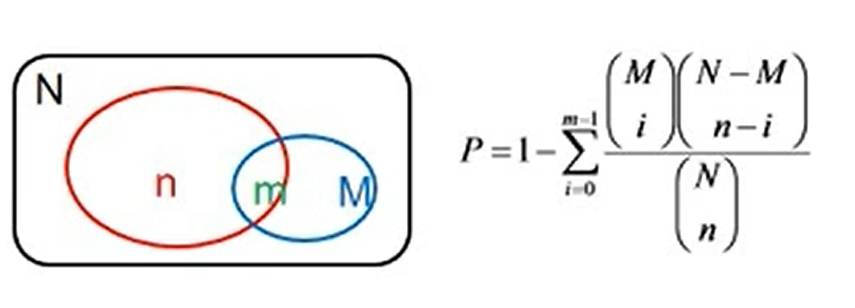
N为所有基因中具有term注释的基因数目
n为N中差异表达基因的数目
M为所有基因中注释到某特定term条目的基因数目
m为注释到某特定term条目的差异表达基因数目
超几何分布(hypergeometric)是统计学上一种离散概率分布。它描述了由有限个物件中抽出n个物件，成功抽出指定种类的物件的个数（不归还）。超几何分布和Fisher‘s Exact Test是完全一模一样的原理，只是两种不同的称谓。

### 1.3 GSEA (Genes Set Enrichment Analysis)
ORA方法只考虑显著差异基因，经常尝试不同的cutoff，上调基因和下调基因分开富集。这种策略会因过高的阈值而忽略变化较小的基因，GSEA直接解决了这一局限性。所有基因均可用于GSEA，GSEA聚合了一个基因集内所有基因统计数据，因此能够以一种小而协调的方法检测预定义的基因集中所有基因的变化情况。
#### GSEA介绍
- GSEA是一种基于基因集（也可以理解某个term）的富集分析方法
- 基于基因表达数据与表型的关联度（也可以理解为表达量的变化，比如log2FC）的大小排序。
- 判断每个基因集内的基因是否富集与表型相关度排序后基因列表的上部或下部，从而判断此基因集内基因的协同变化对表型变化的影响。
#### GSEA原理与步骤
1. 背景基因排序
   将全部基因按照某种指标（差异分析p-value，表型相关性，表达量等）进行排序，比如Log2FC排序
2. 目标基因富集
   将某个特定类型的基因在排序表中标出。目标基因可以是某个通路或者GO terms的基因等
3. 计算富集分数
   使用加和法，计算ES值变化，将ES曲线最大值作为富集分数（Enrichment Score）
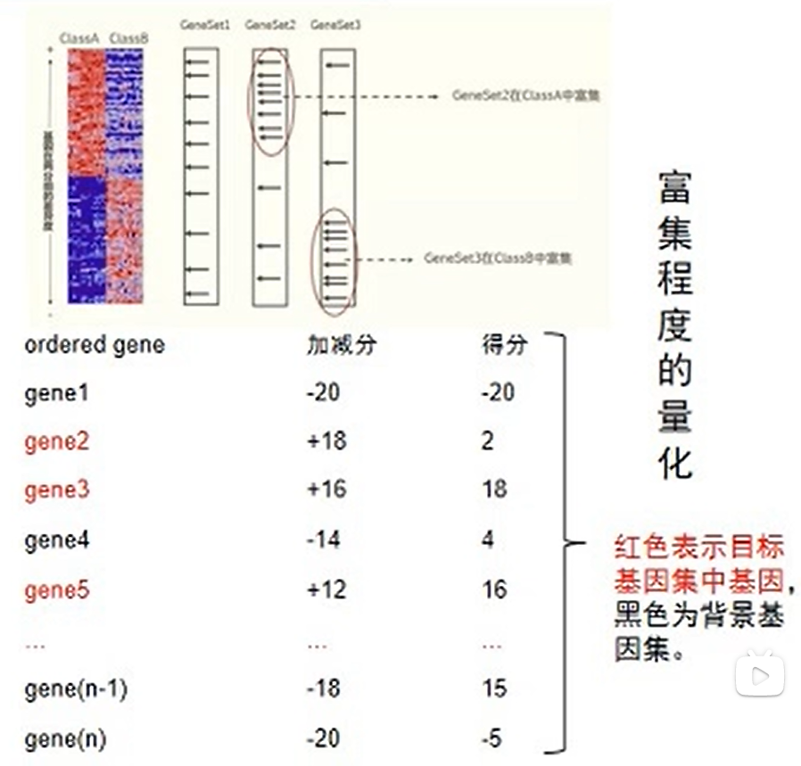
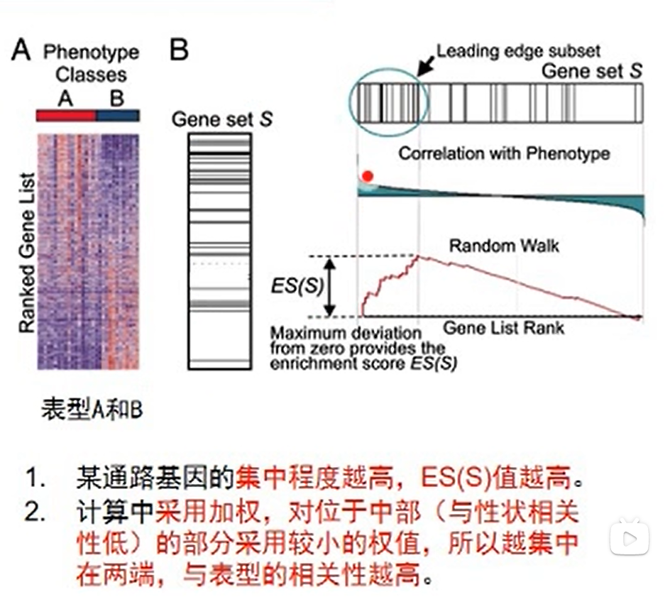
4. permutation test
   根据富集分数计算P值和FDR
   **permutation test的定义：** 评估富集得分（ES）的显著性。通过基于表型而不改变基因之间关系的排列检验（permutation test）计算观察到的富集得分（ES）出现的可能性，计算pvalue
   **permutation test的原理：** 
   - 假设： 全部基因集L有10000个，某通路基因有50个（目标基因集S），GSEA计算得到目标基因富集分数（ES）= 3
   - 采用随机抽样法，从10000个基因中抽取50个基因，构建虚拟目标基因集A，计算A的ES值。随机抽样10000此，从而得到虚拟ES值10000个。
   - 根据真实ES值在10000个虚拟ES中的位置，如果位于两端极端位置（例如，前top1%或后top1%），则说明S所计算出的ES值不是随机获得，而是显著偏大（说明基因集小中基因的排位靠前）或显著偏小（说明基因集S中基因的排位靠后）。真实的ES值对应位置，例如属于前50名，p=50/10000
#### GSEA结果图解析
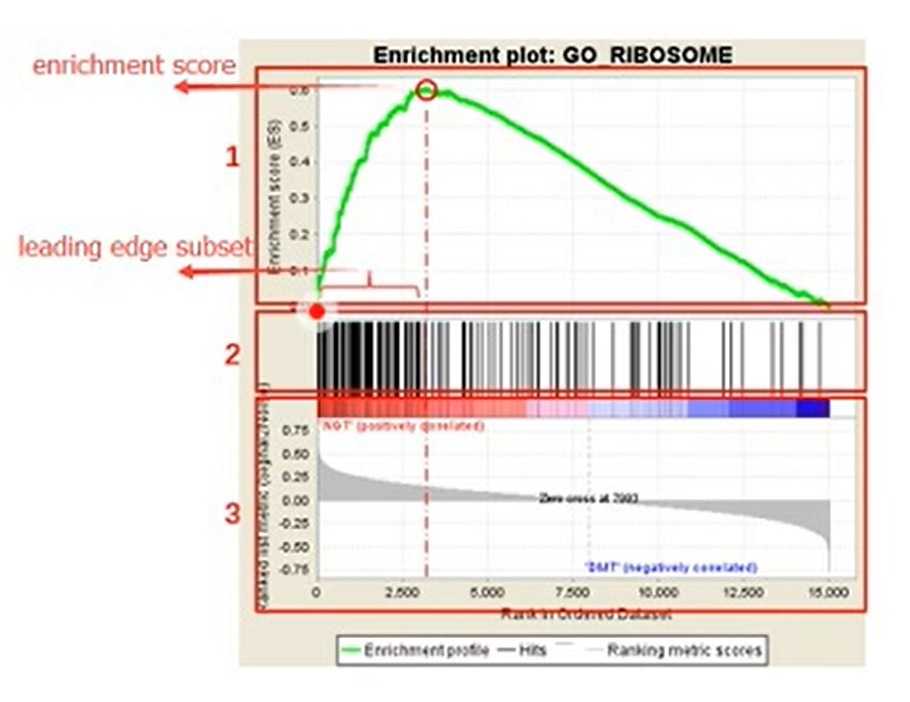
**Enrichment Score:** 最上面的绿线是遍历排好序的基因列表，是计算ES值的过程：遍历基因集L（背景gene set）， 当基因出现在S（目标基因）中加分，反之减分；加减分值由基因与表型的相关性决定。当分值积累到最大时就是富集分数。
Leading-edge subset：
对富集得分贡献最大的基因成员集
1: Enrichment score折线图
2：目标基因位置
3: 每个基因对应的信噪比
#### GSEA和ORA方法的比较
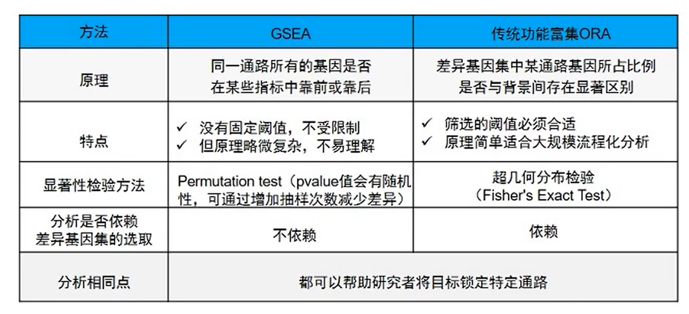


## 2 基因功能注释数据库
收集了各种物种基因的功能注释的数据库，包括GO, KEGG， Reactome和MSigDB等常见基因功能注释数据库。
### 2.1 GO
http://geneontology.org/
GO(Gene Ontology)数据库：数据库由基因本体论联合会建立，该数据库将全世界所有与基因有关的研究结果进行分类汇总。对不同数据库中关于基因和基因产物的生物学术语进行标准化，对基因和蛋白功能进行统一的限定和描述。基因本体论定义了用来描述基因功能的概念/类，以及这些概念之间的关系。GO术语组织在一个有向无环图中，其中术语之间的边表示父子关系。
它将功能分为三个方面：BP（生物学过程biological process）， CC（细胞元件cellular component）和 MF（分子功能molecular function）。在这三个分支下面又分很多小层级（level），level级别数字越大，功能描述越细致（level1， level2，level3和level4）。通过GO注释，可以大致了解某个物种的全部基因产物的功能分类情况。
### 2.2 KEGG
http://www.genome.jp/kegg
KEGG（Kyoto Encyclopedia of Genes and Genomes）数据库，是由日本京都大学和东京大学联合开发的数据库，是基因组测序和其他高通量实验技术生成的大规模分子数据集的整合和解读的突出参考知识库，可以用查询代谢途径，酶（或编码酶的基因），产物等，也可以通过BLAST比对查询未知序列的代谢途径信息。
KEGG是一组人工绘制的代表分子相互作用和反应网络的通路图。这些途径涵盖了广泛的生化过程，可分为7大类：新陈代谢，遗传和环境信息处理，细胞过程，机体系统，人类疾病和药物开发。
### 2.3 Reactome 数据库
Reactome数据库是一个免费开源的通路数据库，提供直观的生物信息学工具，用于可视化，解释和分析途径相关知识，以支持基础研究，基因组分析，建模，系统生物学研究等。Reactome利用PSIQUIC Web服务来覆盖来自Reactome功能交互网络和外部交互数据库（如IntAct，ChEMBL， BioGRID和iRefIndex）的分子交互数据。目前版本（v61）Reactome于2017年6月22日发布。Pathway注释又生物学专家与Reactome编辑人员合作编写，并交叉引用许多生物信息学数据库。
目前该库覆盖了19个物种的通路研究，包括经典的代谢通路，信号转导，基因转录调控，细胞凋亡与疾病。数据库引用了100多个不同的在线生物信息学资源库，包括NCBI, Ensembl, UniProt, UCSC基因组浏览器，ChEBI小分子数据库和PubMed文献数据库等。
### 2.4 MSigDB 数据库
是由Broad Institute研究所的科学家提出的GSEA富集方法同时提供的基因集数据库MSigdb。
对于human的基因，从位置，功能，代谢途径，靶标结合等多种角度出发，构建出了许多的基因集合，一个基因集合中就是具有相似位置或类似功能的许多基因，Broad Institue研究所将它们构建的基因集合保存在MSigDB数据库中。
包括H和C1-C7八个系列（Collection），可以直接使用，也可以用其中的一部分进行分析。该数据库是不断更新和完善的，目前最新版本为v6.2，更新于2018年7月，共收录了17810个基因集。
H：hallmark gene sets （效应）特征基因集合，共50组；
C1: positional gene sets 位置基因集合，根据染色体位置，共326个；
C2：curated gene sets （专家）共识基因集合，基于通路，文献等
C3:motif gene sets 模式基因集合，主要包括microRNA和转录因子靶基因两部分；
C4：computational gene sets计算基因集合，通过挖掘癌症相关芯片数据定义的基因集合
C5:GO gene sets Gene Ontology 基因本体论，包括BP, MF, CC三部分；
C6:oncogenic signatures癌症特征基因集合，大部分来源于NCBI GEO未发表芯片数据；
C7:immunologic signatures免疫相关基因集合。
### 2.5数据库总结
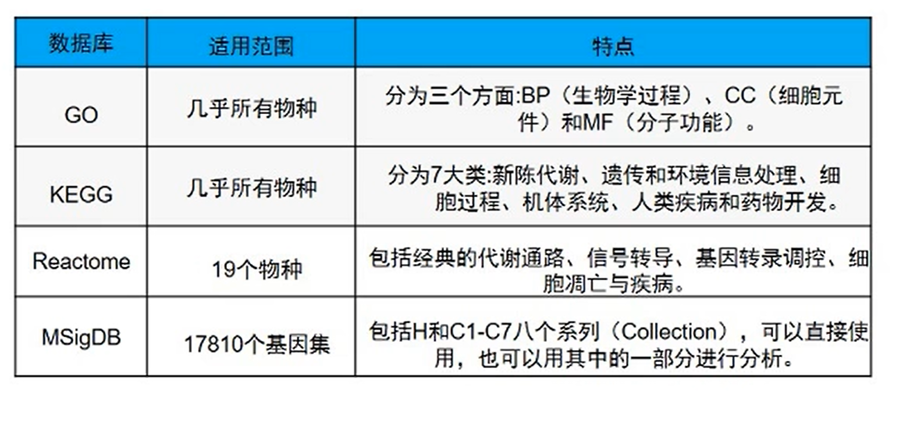

## 3 Windows平台下GSEA软件的应用
### 3.1 GSEA 软件安装
软件下载地址： http://www.gsea-msigdb.org/gsea/downloads.jsp
### 3.2 GSEA 输入文件格式
所有矩阵的列以tab键分割，不同类型的数据格式和后缀要求见下表
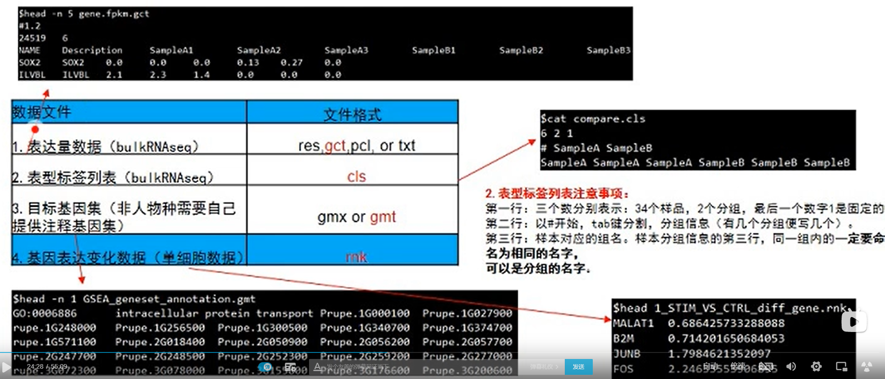
图中不是34个样品，是6个样品
### 3.3 GSEA软件介绍与输入文件
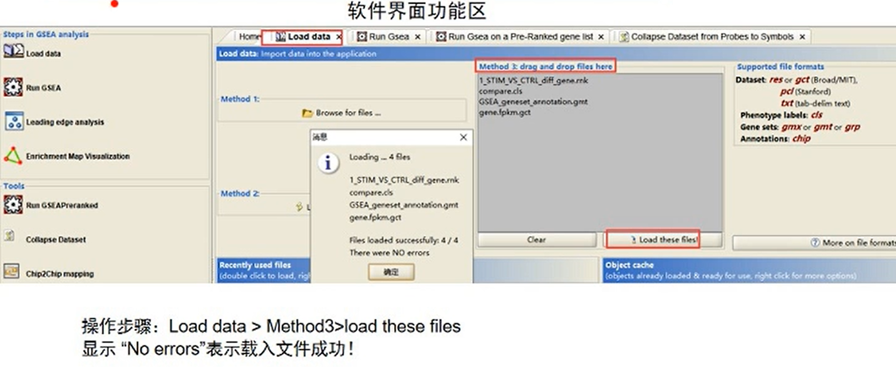
### 3.4 GSEA参数设置及其软件运行

https://www.gsea-msigdb.org/gsea/doc/GSEAUserGuideFrame.html

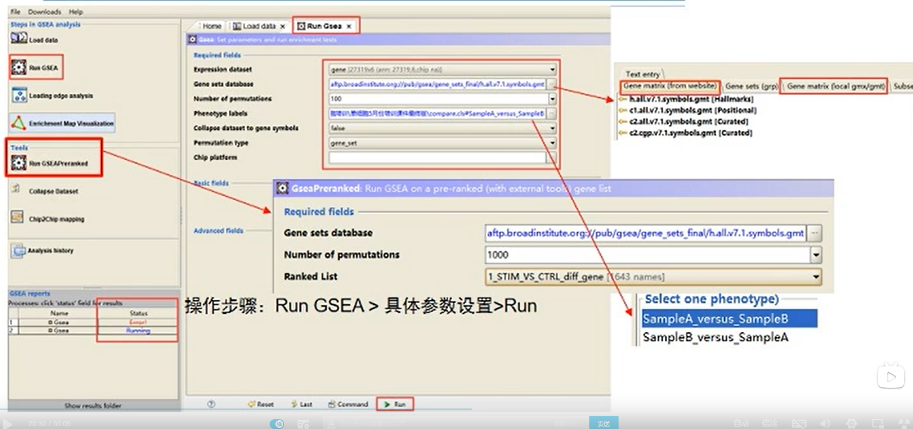
single cell GSEA分析选择 Run GSEAPreranked

### 3.5 结果路径
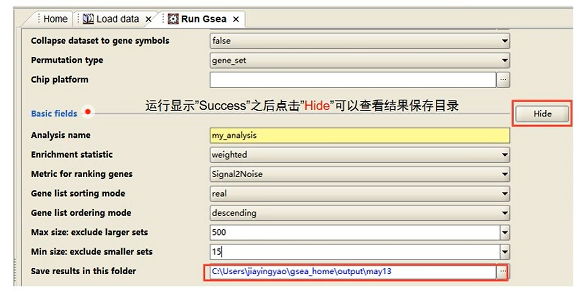

### 3.6 结果解析
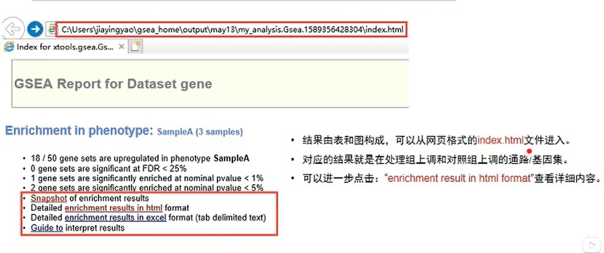

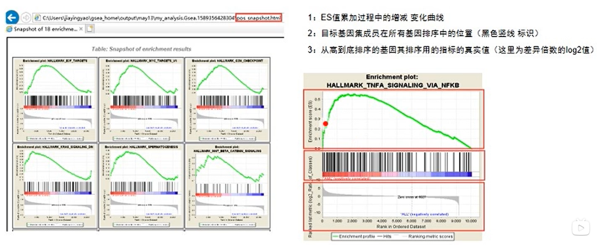

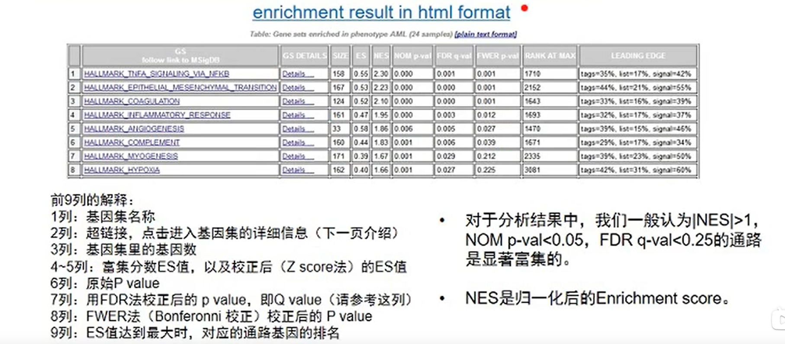

## 4 R环境下clusterProfiler包的应用
软件安装
```R
#R version 3.5.1
source("http://bioconductor.org/biocLite.R")
biocLite()
biocLite("clusterProfiler")
#R version 3.6
if(lrequireNamespace("BioManager", quietly=TRUE)
   install.packages("BiocManager")
BiocManager::install("clusterProfiler")
library(clusterProfiler)
```
依赖的R包：
```R
library(ReactomePA)
library(misigdbr)
library(org.Hs.eg.db)
library(org.Mm.eg.db)
library(DOSE)
library(ggplot2)
library(ggupset)
library(enrichplot)
library(heatmap3)
```

备注：可通过类似？gseGO（）查看该函数帮助文档，包括具体使用说明和参数含义。


### 单细胞数据准备
**原始数据下载**
https://seurat.nygenome.org/src/contrib/ifnb.SeuratData_3.0.0.tar.gz
得到原始raw.ifnb.rds文件，之后哦那个seurat元件质控，标准化分成11个cluster。之后用FindMarkers()函数做每个cluster两个样本之间的差异基因分析。
**差异基因结果文件**
1_STIM_VS_CTRL_diff_gene.csv
备注该文件是cluster1两样本之间的差异基因结果，为了尽可能保留所有基因的结果。cutoff为logfc.threshold=0, test.use='wilcox', min.pct = 0.1
### 数据读取和对象的构建
数据读取并构建gene和geneList对象
以下是cluster1举例，abs(avg_logFC>=0.5)
```R
de_genes<-function(file, OrgDb_s, cut){
   data <- read.csv(file, header=T)
   colnames(data)[1] <-'SYMBOL'
   #ENTREZID, SYMBOL, ENSEMBL
   k=keys(OrgDb_s, keytype="SYMBOL")
   #gene name的转换从SYMBOL到ENTREZID
   geneinfo<- bitr(k, fromType="SYMBOL", toType=c("ENTREZID"), OrgDb_s)
   geneset <- merge(geneinfo.data, by="SYMBOL")
   geneList <- geneset[, 'avg_logFC']
   names(geneList) <- as.character(geneset[.'ENTREZID'])
   geneList <- sort(geneList, decreasing=TRUE)
   gene <- as.character(subset(geneset.abs(avg_logFC)>=cut)$ENTREZID)
   genes <- list(gene=gene, geneList=geneList)
   return(genes)
}
path <- getwd()
i <-1
file <- paste(path, "/////", i,"_STIM_VS_CTRL_diff_gene.csv",sep='')
genes<-de_genes(file, org.Hs.eg.db, 0.5)
gene <-genes$gene
geneList <-genes$geneList
```
构建正确的对象，需要注意以下几点：
1. gene为enrich的输入对象，geneList为GSEA的输入对象。
2. avg_logFC不能为NA, Inf, -Inf值。
3. geneList必须是sort属性
### ORA和GSEA分析
1. GO数据库
   ```R
   #universe=names(geneList), 可设置bg gene list
   ont <- enrichGO(gene=gene,OrgDb=org.Hs.eg.db,pvalueCutoff=1, qvauleCutoff=1, minGSSize=1, maxGSSize=50000, ont=ont)
   y<- gseGO(geneList=geneList, OrgDb=org.Hs.eg.db,pvalueCutoff=1, nPerm=10000, minGSSize=1, maxGSSize=50000, ont=ont, verbose=FALSE)
   ```
2. KEGG数据库
   ```R
   #use_internal_data:logical, use KEGG.db(use_internal_data=T) or latest online KEGG data (use_internal_data=F)
   internal <- F
   x<- enrichKEGG(gene=gene, organism='hsa', pvalueCutoff=1, minGSSize=1, maxGSSize=50000, qvalueCutoff=1, use_internal_data=internal)
   y<- gseKEGG(geneList=geneList, organism='hsa', nPerm=10000, minGSSize=50000, pvalueCutoff=1, by='gsea', verbose=FALSE, use_internal_data=internal)
   ```
3. reactome数据库
   ```R
   #organism:human, rat, mouse, celegans, yeast, zebrafish, fly
   library(ReactomePA)
   x<- enrichPathway(gene=gene, organism='human', pvalueCutoff=1, minGSSize=50000, qvalueCutoff=1)
   y <- gsePathway(geneList, nPerm=10000, pvalueCutoff=1, organism='human', verbose=FALSE, minGSSize=1, maxGSSize=50000)
   ```
4. MSigDB数据库ORA和GSEA分析
   ```R
   #MSigDB数据库terms库的建立
   library(msigdbr)
   m_t2g <- msigdbr(species="Homo sapiens", category="C6")%>% dplyr::select(gs_name, entrez_gene)
   x<- enricher(gene, TERM2GENE=m_t2g)
   y<- GSEA(geneList, TERm2GEne=m_t2g)
   msigdbr_show_species()
   head(m_t2g)
   ```
备注:
   1. GO数据库如果物种是人，那么需要载入org.Hs.eg.dg包，如果是小鼠需要org.Mm.eg.db包。目前只支持20个物种的OrgDb数据库，其他物种信息请参考http://bioconductor.org/packages/release/BioViews.html#__OrgDb
   2. KEGG数据库如果是人hsa，小鼠用mmu. http://www.genome.jp/kegg/catalog/org_list.html
   3. Reactome数据库人是human，小鼠是mouse。需要有OrgDb数据库支持。（目前只支持这七个物种：human，rat，mouse， celegans，yeast， zebrafish，fly）
### 结果存储及其可视化
```R
#结果存储
prefix <- 'C1'
database <- 'KEGG'
x <- setReadable(x, OrgDb=org.Hs.eg.db, keyType="ENTREZID")
y <- setReadable(y, OrgDb=org.Hs.eg.db, keyType="ENTREZID")
write.table(x, file=paste(prefix, database, "enrich_result.xls", sep="_"), sep="\t", quote=FALSE, row.names=FALSE)
write.table(y, file=paste(prefix, database, "gse_result.xls", sep="_"), sep="\t", quote=FALSE, row.names=FALSE)
#ORA可视化
graph <- paste(prefix, database, 'barplot.pdf', sep='_')
p1 <- barplot(x, showCategory=10, xlab='Count')
pdf(graph, w=6, h=4)
print(p1)
dev.off()
#GSEA可视化
graph <- paste(prefix, database, 'gseplot.pdf', sep='_')
pdf(graph, w=6, h=4)
ID<-ySID[1]
main <- paste("enrichmentScore=", signif(y[ID,]$enrichmentScore, digits=2), sep="")
p<-gseaplot2(y, geneSetID=ID, pvalue_table=T, title=main)
print(p)
dev.off()
```

## 5 基因功能富集分析在单细胞的应用
**单细胞文献富集分析**
https://www.cell.com/cell/fulltext/S0092-8674(19)31119-5?_returnURL=https%3A%2F%2Flinkinghub.elsevier.com%2Fretrieve%2Fpii%2FS0092867419311195%3Fshowall%3Dtrue
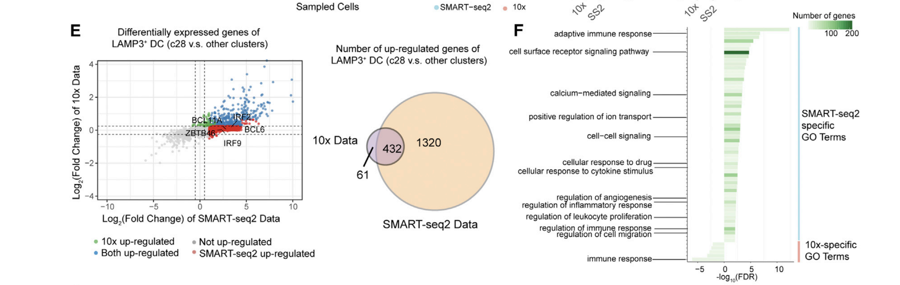

https://www.sciencedirect.com/science/article/pii/S1074761319304959
Gene set enrichment revealed IFN-responsive clusters(2 and 4) and clusters enriched for TNF signaling (3 and 6)该图对每个cluster的所有marker gene做gsea富集分析并利用heatmap3包进行热图展示
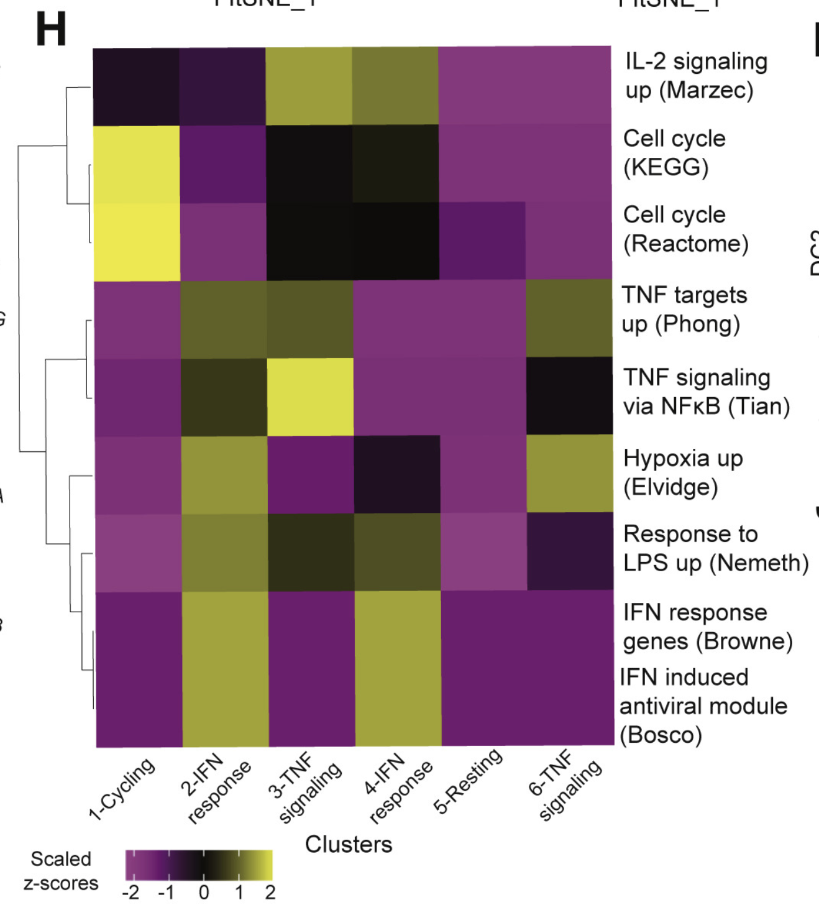

**用compareCluster函数做ORA分析**
```R
path<-'clusterProfiler_test/result/'
outdir <- 'clusterProfiler_test/output/'
prefix<- 'STIM_VS_CRTL'
setwd(path)
#1. get scSamples
scgene<- list()
scgeneList<- list()
for (i in (1:11)){
   file <- paste(path, '/result/', i, '_STIM_VS_CRTL_diff_gene.csv', sep='')
   genes <- de_genes(file, org.Hs.eg.db, 0.5)
   scgenes <- c(scgene, list(genes$gene))
   scgeneList <- c(scgeneList, list(genes$genelist))
   names(scgene)[i] <- paste("C", i, sep='')
   names(scgeneList)[i] <- paste("C", i, sep="")
}
summary(scgene)
summary(scgeneList)
prefix <- 'enrichKEGG'
xx <- compareCluster(scgene, fun='enrichKEGG', organism='hsa', pvalueCutoff=0.05, use_internal_data=internal)
#One of "groupGO", "enrichGO", "enrichKEGG", "enrichDO" or "enrichPathway"
write.table(xx, paste(outdir, paste(prefix, "compareClusterResult.xls", sep="_"), sep="/"), quote=F, row.names=F, sep='\t')
pdf(paste(outdir, paste(prefix, "compareClusterResult.pdf", sep="_"), sep="/"), w=10, h=8)
p1 <- dotplot(xx, showCategory=10, includeAll=TRUE)
print(p1)
dev.off()
```
**Heatmap3 of clusters**
```R
#dataP_merge_heatmap3_plot function
dataP_merge_heatmap3_plot<-function(outdir, prefix, data, n, cut=0.05){
   dataP<-dataSC1[, c('ID', 'Description', 'pvalue')]
   colnames[dataP][3]<- 'C1'
   for (i in (2:n)){
      dataP<-merge(dataP, data[[i]][, c('ID', 'Description','pvalue')], by=c('ID', 'Description'), sll=T)
      colnames(dataP)[2+i]<-paste('C',i,sep='')
   }
   rownames(dataP)<-dataP$Description
   dataP[is.na(dataP)] <- 1
   n1 <- dim(dataP)[2]
   Pmin<- apply(dataP[,3:n1], 1, min)
   dataP$Pmin<-Pmin
   matrix<-subset(dataP, Pmin<cut)[, 3:n1]
   #所有cluster样品间GSEAKEGG富集terms Pvalue合并表格，表头分别为ID，Description， C1，C2， C11 Pmin。其中Pmin是每个term在所有cluster间的最小值
   write.table(dataP, paste(outdir, paste(prefix, "ClusterResult.xls", sep="_"), sep='/'), quote=F, row.names=F, sep='\t')
   #Pmin<1 阈值所有term在样本间的富集，log10（pvalue）每行zscore转换热图展示，颜色越红表示zscore值越大，pvalue越小，即该term在相应cluster中越富集。
   pdf(paste(outdir, paste(prefix, 'heatmap3clusterResult.pdf', sep='_'), sep='/'), w=10, h=8)
   heatmap3(-log10(matrix), Colv=NA, cexRow=0.5, cexCol=1, scale='row')
   dev.off()
   return(dataP)
}

#enrichKEGG and gseKEGG for each cluster
scEnrich <- list()
scGSEA <- list()
for (i in (1:11)){
   prefix <- paste("C", i, sep="")
   gene<-scgene[(i)]
   geneList<-scgeneList[(i)]
   x <- enrichKEGG(gene=gene, organism='hsa', pvaleCutoff=1, minGSSize=1, maxGSSize=50000, qvalueCutoff=1, use_internal_data=F)
   y <- gseKEGG(geneList=geneList, organism='hsa', nPerm=10000, minGSSize=1, maxGSSize=50000, pvalueCutoff=1, by='fgsea', verbose=FALSE, use_internal_data=F)
   write.table(x, paste(outdir, paste(prefix, "enrichKEGGResult.xls", sep='_'),sep='/'), quote=F, row.names=F, sep='\t')
   wirte.table(y, paste(outdir, paste(prefix, "gseKEGGResult.xls",sep='_'), sep='/'), quote=F, row.names=F, sep='\t')
   scEnrich<- c(scEnrich, list(x))
   scGSEA<- c(scGSEA, list(y))
   names(scEnrich)[i] <- paste("C", i, sep='')
   names(scGSEA)[i] <- paste("C", i, sep='')
}
cut <- 0.001
scEnrichP<- dataP_merge_heatmap3_plot(outdir, 'enrichKEGG_mergeP', scEnrich, 11, cut)
scEnrichP <- dataP_merge_heatmap3_plot(outdir, 'GSEAKEGG_mergeP', scGSEA, 11, cut)
```
