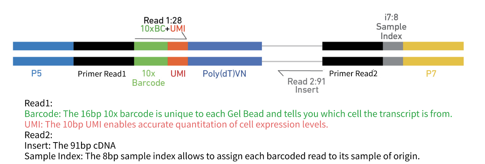

# 10X Single Cell RNAseq workflow
## 1. Introduction to single-cell RNA-seq
### 1.1 Bulk RNA-seq
Bulk RNAseq technologies have been widely used to study gene expression patterns at population level in the past decade.
- A major breakthrough(replacement of microarray) in the late 00's and has been widely used since.
- Measures the average expression level for each gene across a large population of input cells.
- Useful for comparative transcriptomics, e.g. samples of the same tissue from different species
- Useful for quantifying expression signatures from ensembles, e.g. in disease studies
- Insufficient for studying heterogeneous systems, e.g. early development studies, complex tissues(brain)
- Does not provide insights into the stochastic nature of gene expression
### 1.2 scRNA-seq
 The advent of single-cell RNA sequencing (scRNA-seq) provides unprecedented opportunities for exploring gene expression profile at the single-cell level. Currently, scRNA-seq has become a favorable choice for studying the key biological questions of cell heterogeneity and the development of early embryos (only include a few number of cells), since bulk RNA-seq mainly reflects the averaged gene expression across thousands of cells.The recently developed droplet-based single-cell transcriptome sequencing (scRNA-seq) technology makes it feasible to perform a population-scale scRNA-seq study, in which the transcriptome is measured for tenes of thousands of single cells from multiple individuals.
 - A new technology, first publiction by Tang et al, 2009.
 - Did not gain widespread popularity until 2014 when new protocols and lower sequencing costs made it more accessible
 - Measures the distribution of expression level for each gene across a population of cells
 - Allows to study new biological questions in which cell-specific changes in transcriptome are important, e.g. cell type identification, heterogeneity of cell response, stochasticity of gene expression, inference of gene regulatory networks across the cells.
 - Datasets range from 100 to 1000000 cells and increase size every year.
 - Currently there are several different protocols in use, e.g. SMART-seq2, CELL-seq and Drop-seq.
  
  Figure 1.1 different protocols to prep single cell library
  Hwang, B., Lee, J.H. & Bang, D. Single-cell RNA sequencing technologies and bioinformatics pipelines. Exp Mol Med 50, 1–14 (2018).
 - There are also commercial platforms available, including the Fluidigm C1, Wafergen ICELL8 and the 10X Genomics Chromium
 - Several computational analysis methods from bulk RNA-seq can be used
 - In most cases computational analysis requires adaption of the existing methods or development of new ones.
Note: got lots of idea from website "Analysis of single cell RNA-seq data" https://scrnaseq-course.cog.sanger.ac.uk/website/index.html
## 2. Data Analysis Workflow


Cell Ranger is a set of analysis pipelines that process Chromium single-cell data to align reads, generate feature-barcode matrices, perform clustering and other secondary analysis, and more. Cell Ranger includes four pipelines relevant to the 3' Single Cell Gene Expression Solution and related products.


10X cellranger website 
### 2.1 Data demultiplexing
`cellranger mkfastq` is used to demulitiplex BCL files (https://support.10xgenomics.com/single-cell-gene-expression/software/pipelines/latest/using/tutorial_fq). It is a wrapper around Illumina's bcl2fastq, with additional features that are specific to 10X libraries and a simplified sample sheet format.
```shell
cellranger mkfastq --id={output_foldername} \
		   --run={flowcell_runid_path} \
		   --csv=samplesheet.csv
```


Final fragment from Chromium single cell 3' v3 library

- I1.fastq.gz: 8bp P7 index (sample index)
- R1.fastq.gz: total 28 bp, 16bp barcode + 10bp UMI
- R2.fastq.gz: 91bp cDNA
  
The FASTQ files are named according to the sample column of the sample sheet. If a sample ID was not specified, the flowcell ID is used instead(not shown here). In addition to the FASTQ files, bcl2fastq generates various summary files. If -stats-dir was not specified, summary and statistic files will be stored in a Stats folder by default.


### 2.2 Data Process and Quality Control
Reads from scRNA-seq were processed by Cell Ranger software (10X Genomics) with the default parameters for each sample seperately. In short, alignment to the reference, UMI(unique molecular identifier) collapsing. UMI counting and initial quality control was performed.The filtered gene expression matrices containing only celluar barcodes were generated in this step. Then Seurat R package was further used to get data quality control.
#### 2.2.1 Cellranger count
`Cellranger count` quantifies single-cell gene expression. Meanwhile, it provides sequencing summary
https://support.10xgenomics.com/single-cell-gene-expression/software/pipelines/latest/using/tutorial_ct
`Cellranger count` takes FASTQ files from `cellranger mkfastq` and performs alignment, filtering, barcode counting and UMI counting. It uses the Chromium cellular barcodes to generate feature-barcode matrices, determine clusters, and perform gene expression analysis. The `count` pipeline can take input from multipe sequencing runs on the same GEM well. `cellranger count` also process Feature Barcode data alongside Gene Expression reads.

```shell
cellranger count --id={sample} --transcriptome={reference genome} --fastqs={fastq files} 
```
If you are beginning with FASTQ files that have already been demultiplexed with `bcl2fastq` directly, or from a public source such as SRA, you can skip `cellranger mkfastq` and begin with `cellranger count`. 


##### Initial quality control
```python
python qc.py --input --output
```
##### Alignment Summary
```python
python alignment.py --input --output
```
> Gene Expression Algorithms Overiew
> **Alignment**
> Read Trimming
> This section on read trimming applies to 3' gene expression assays.
> A full length cDNA construct is flanked by the 30 bp template switch oligo (TSO) sequence, AAGCAGTGGTATCAACGCAGAGTACATGGG, on the 5' end and poly-A on the 3'end. Some fraction of sequencing reads are expected to contain either or both of these sequences, depending on the fragment size distribution of the sequencing library. Reads derived from short RNA molecules are more likely to contain either or both TSO and poly-A sequence than longer molecules.
> Since the presence of non-template sequence in the form of either template switch oligo (TSO) or poly-A, low-complexity ends confound read mapping, TSO sequence is trimmed from the 5' end of read2 and poly-A is trimmed from the 3' end prior to alignment. Trimming improves the sensitivity of the assay as well as the computational efficiency of the software pipeline.
> Tags ts:i and pa:i in the output BAM files indicate the number of TSO nucleotides trimmed from the 5' end of read2 and the number of poly-A nucleotides trimmed from the 3'end. The trimmed bases are present in the sequence of the BAM record, and the number of poly-A nucleotides trimmed from the 3' end. The trimmed bases are present in the sequence of the BAM record, and the CIGAR string shows the position of these soft-clipped sequences
> Genome Alignment
>  Cell Ranger uses an aligner called STAR, which performs splicing-aware alignment of reads to the genome. Cell Ranger then uses the transcript annotation GTF to bucket the reads into exoinic, intronic, and intergenic, and by whether the reads align (confidently) to the genome. A read is exonic if at least 50% of it intersects an exon, intronic if it is non-exonic and intersects an intron, and intergenic otherwise.
> MAPQ adjustment
> For reads that align to a single exonic locus but also align to 1 or more non-exonic loci, the exonic locus is prioritized and the read is considered to be considered to be confidently mapped to the exonic locus with MAPQ 255
> Transcriptome Alignment
> Cell Ranger further aligns exonic and introinic confidently mapped reads to annotated transcripts by examining their compatibility with the transcriptome. As shown below, reads are classified based on whether they are sense or antisense and based on whether they exonic, intronic or whether their splicing pattern is compatible with transcript annotations associated with that gene.
> By default, reads that are transcriptomic (blue) are carried forward to UMI counting. In certain cases, such as when the input to the assay consists of nuclei, there may be high levels of intronic reads generated by unspliced transcripts. In order to count these intronic reads, the `cellranger count` and `cellranger multi` pipelines can be run with option `include-introns`. If this option is used, any reads that map in the sense orientation to a single gene - which include the reads labeled transcriptomic(blue), exonic (light blue), and intronic (red) in the diagram above - are carried forward to UMI counting.
> Furthermore, a read is considered uniquely mapping if it is compatible with only a single gene. Only uniquely mapping reads are carried forward to UMI counting.
> UMI Counting 
##### Cell Calling and UMI Counting
```python
python cell_umi.py --input --output
```
##### Optional steps based on experiment design

`cellranger aggr` aggregates outputs from multiple runs of cellranger count, normalizing those runs to the same sequencing depth and the recomputing the feature-barcode matrices and analysis on the combined data. The `aggr` pipeline can be used to combine data from multiple samples into an experiment-wide feature-barcode matrix and analysis.

`cellranger reanalyze` takes feature-barcode matrices produced by `cellranger count` or `cellranger aggr` and rerun the dimensionality reduction, clustering, and gene expression algorithms using tunable parameter settings.


`cellranger multi` is ued to analyze Cell Multiplexing data. It inputs FASTQ files from `cellranger mkfastq` and performs alignment, filtering, barcode counting, and UMI counting. It uses the Chromium cellular barcodes to generate feature-barcode matrices, determine clusters, and perform gene expression analysis. The `cellranger multi` pipeline also supports the analysis of Feature Barcode data.

The exact steps of the workflow vary depending on how many samples, GEM wells, and flowcells you have, and wether you are including data from Feature Barcodes or Cell Multiplexing kits.

**One Sample, One GEM Well, One Flowcell**
- `cellranger mkfastq` demultiplex bcl files to fastq files
- `cellranger count` performs alignment, filtering, barcode counting and UMI counting. It uses the Chromium cellular barcodes to generate feature-barcode matrices, determine clusters, and perform gene expression analysis.
**One sample, One GEM well, Multiple Flowcells**
In this case, all reads can be combined in a single instance of the `cellranger count` pipeline. 
**One Sample, Multiple GEM Wells, One Flowcell**
Here, one sample is processed through multiple GEM wells. This is typically done when conducting technical replicate experiments. The libraries from the GEM wells are then pooled onto one flowcell and sequenced. In this case, demultiplex the data from the sequencing run with `cellranger mkfastq`, then run the libraries from each GEM well through a seperate instance of `cellranger count`. Then you can perform a combined analysis using `cellranger aggr`, as described in Multi-Library Aggregation.
**Multiple Samples, Multiple GEM Wells, One Flowcell**
In this example, multple samples are processed through multiple GEM wells, which generate multiple libraries and are pooled onto one flowcell. After demultiplexing, you must run `cellranger count` separately for each GEM well; if you have two GEM wells, then run `cellranger count` twice. Then you can aggregate them with a single instance of `cellranger aggr`, as described in Multi-Library Aggregation
**Multiple Samples, One GEM Well, One Flowcell (Cell Multiplexing)**
Cell Ranger 6.0 introduces support for analyzing Cell Multiplexing data. In this case, multiplex samples are uniquely tagged with Cell Multiplexing Oligos (CMOs), enabling multiple samples to be pooled in a single GEM well. This results in a CMO and Gene Expression (GEX) library for each GEM well. After running `cellranger mkfastq` to generate FASTQ files, run the `cellranger multi` pipeline on the combined FASTQ data for the GEX and CMO libraries.


#### 2.2.2 Quality control and cell filtering based on Seurat R package
The "filtered_feature_bc_matrix" generated by Cell Ranger were read into the Seurat R package. For each cell, quality control metrics such as the total number of counts and the proportion of counts in mitochondrial genes were calculated.
```R
Rscript qc_seurat.R --input --output
```
Cells that met any one of the following criteria were filtered out for downstream processing in each sample: < 200 genes with present in each cell, genes with non-zero counts in at most 3 cells, > 50,000 feature count(potential multiplets), or the proportion of the feature count attributable to mitochondrial genes was greater than 50%
seurat is used for filtering
```R
Rscript filter.R --input --output
```

### 2.3 Identification of Highly Variable Genes
Feature selection removes the uniformative genes and identifies the most relevant features to reduce the number of dimensions used in downstream analysis. The identification of highly variable genes (HVGs) was based on the assumption that the highly variable expression of these genes across cells is resluted from biological effects rather than merely technical noise.
After cell filtering, 10X gene expression matrices from each sample were loaded into Seurat. The expressions of each gene were normalized by total counts for that cell, mulitplied by a scale factor (the median UMI counts for all cells within the sample), and natural-log transformed using log1p. Then the expressions of each gene were scaled.
Next, highly variable genes were identified using FindVariableGenes function with the highest standardized variance selected by selection method = 'vst'. The top 3000 most variable genes of each sample selected by Seurat were used to compute the PCs (principal components).
Normalized expression of cells
```R
Rscript normalization.R --input --output
```

Highly variable genes were identified using FindVariableGenes function
```R
Rscript HVG.R --input --output
```
### 2.4 Cell subpopulation identification
A key goal of 10X scRNA-seq data analysis is to identify cell subpopulations (different populations are often distinct cell types) within a certain condition or tissue to unravel the heterogeneity of cells. To identify a gene expression signature associated with this sample or group of cells, HVGs previously determined are used as input for dimensionality reduction via principal component analysis (PCA). The resulting PCs were then used as input for clustering analysis.
#### 2.4.1 Principal Components Analysis
Principal components analysis (PCA) discovers axes in high-dimensional space that capture the largest amount of variation. The PCA on the log-normalized expression values is performed using runPCA function with setting total 50 PCs.
```R
Rscript PCA.R --input {} --output {}
```
#### 2.4.2 Identify Clusters of Cells
To partition the data into clusters of transcriptionally related cells, a shared nearest neighor (SNN) modularity optimization based clustering algorithm is used to identify clusters of cells. In this process, the top PCs retained as input for clustering, generally ranging from 5 to 20, are determined by elbow point as shown in Figure

seurat: FindClusters
```R
Rscript FindClusters.R --input {} --output {}
```
#### 2.4.3 Dimensionality Reduction and Visualization
For visualization purpose, dimensionality was further reduced to 2D using t-distributed stochastic neighbor embedding (t-SNE) and uniform manifold approximation and projection (UMAP). Both of them are try to find a low-dimensional representation that preserves relationships between neighbors in high-dimensional space. Compared to t-SNE, the UMAP visualization tends to have more compact visual clusters with more empty space between them.
```R
Rscript Dimentionality_reduction.R
```
### 2.5 Marker Gene Detection
Identification of marker genes is usually based around the retrospective detection of differential expression between clusters. These marker genes allow us to assign biological meaning to each cluster based on their functional annotation. In the most obvious case, the marker genes for each cluster are a priori associated with particular cell types, allowing us to consider the clustering as a proxy for cell-type identity. Significantly differential expressed genes for each cluster were identified using the Wilcox test with teh thredhold qvaule < 0.05 and log2foldchange > 0.25
#### 2.5.1 List of Marker Genes
```R
Rscript marker_gene.R --input --output
```
#### 2.5.2 Expression Pattern of Marker Genes
Heatmaps showing expression of indicated marker genes for given cells and features.
```R
Rscript marker_gene_heatmap.R --input --output
```
#### 2.5.3 Expression level of Marker Genes
```R
```
#### 2.5.4 t-SNE/UMAP Visualize Expression of Marker Genes
seurat: FindAllMarkers
```R
```
### 2.6 Enrichment analysis
Enrichment analysis is a widely used approach to determine whether known biological functions or processes are over-represented (= enriched) in an experimentally-derived gene list, e.g. a list of differentially expressed genes (DEGs)
The p-value can be calculated by hypergeometric distribution

Here, N is the number of all genes with a GO or KEGG annotation, n is the number of DEGs in N, M is the number of all genes annotated to specific items, and m is number of DEGs in M.
#### 2.6.1 GO Enrichment Analysis
Gene Ontology (GO) is a standardized classification system widely used for gene function, which supplies a set of controlled vocabulary to describe the property of genes and gene products comprehensively. There are 3 ontologies in GO system: molecular function, cellular component and biological process. The basic unit of GO is GO-term, each of which belongs to one type of ontology.
Theis method firstly maps all source genes to GO terms in the database(http://www.geneontology.org/), calculating gene numbers for each term, then using Vallenius non-central hyper-geometric disribution to find significantly  enriched GO terms in source genes comparing to the reference genes background.


Complex heatmaps are efficient to visualize associations between different sources of data sets and reveal potential patterns. The hierarchical clustering is produced by a pre-defined distance method called "euclidean".

Go enrichment Histogram and Scatter plot of marker genes

Enrichment map organizes enriched terms into a network with edges connecting overlapping gene sets. In this way, mutually overlapping gene sets are tend to cluster together, making it easy to identify functional module.

#### 2.6.2 KEGG Enrichment Analysis
The interactions of multiple genes may be involved in certain biological functions. KEGG(Kyoto Encyclopedia of Genes and Genomes) is a collection of manually curated databases dealing with genomes, biological pathways, diseases, drugs and chemical substances. KEGG is utilized for bioinformatics research and education, including data analysis in genomics, metagenomics, metabolomics and other omics studies. Pathway enrichment analysis identifies significantly enriched metabolic pathways or signal transduction pathways associated with differentially expressed marker genes compared with the whole genome background.
```R
```
KEGG enrichment scattered plot shows the DEGs enrichment analysis results in KEGG pathway. The degree of KEGG enrichment is measured by Rich factor, q-value and the number of genes enriched in this pathway. Rich factor refers to the ratio of the DEGs number in the pathway and the number of all genes annotated in the pathway. Q-value is the p-value after normalization and its range is [0,1]. The smaller q-value is, the more significant the enrichment is. The top20 significantly DGEs enriched pathways are displayed in the report. If the enriched pathways are less than 20, all enriched pathways are displayed. 
```R
```

#### 2.6.3 Reactome Enrichment Analysis
The Reactome is a database fo reactions, pathways and biological process, which can be used to browse pathways and submit data to a suite of data analysis tools, containing curated annotations that cover a diverse set of topics in molecular and celluar biology. Reactome terms with padj < 0.05 are significant enrichment.
```R
```

#### 2.6.4 Functional Annotation of Transcription Factor
TFCat is a curated catalog of mouse and human transcription factors (TF) based on a reliable core collection of annotations obtained by experts' review of the scientific literature. Annotated genes are assigned to a functional category and confidence level. We use the differentially expressed marker genes in each cluster to search the TFCat, then provides the annotation of the TF and corresponding reference (PubMed ID).
```R
```

#### 2.6.5 Protein-Protein Interaction Network Analysis
The protein-protein interaction network is constructed for differentially expressed genes in each cluster by using STRING protein interaction database. Protein-protein interaction is provided as network file which can be imported into Cytoscape software and visualized and edited. The central organizing metaphor of Cytoscape is a network graph, with molecular species represented as nodes and intermolecular interactions represented as links, that is, edges, between nodes.
```R
```

