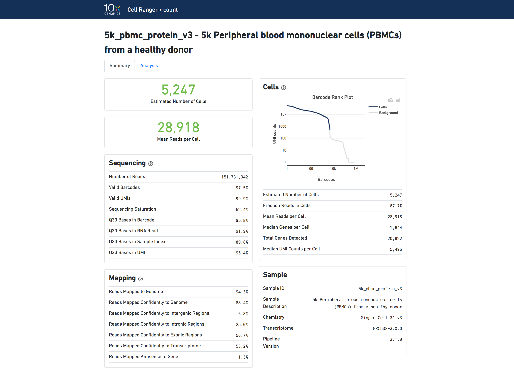
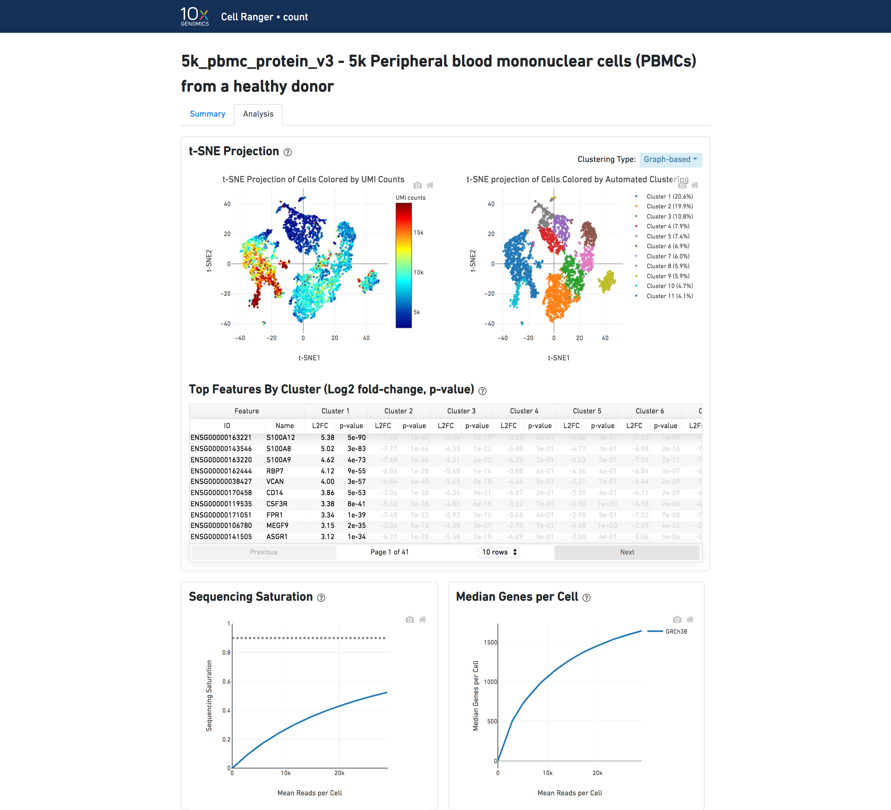

# 10X Single Cell RNAseq workflow
## 1. Introduction to single-cell RNA-seq
### 1.1 Bulk RNA-seq
Bulk RNAseq technologies have been widely used to study gene expression patterns at population level in the past decade.
- A major breakthrough(replacement of microarray) in the late 00's and has been widely used since.
- Measures the average expression level for each gene across a large population of input cells.
- Useful for comparative transcriptomics, e.g. samples of the same tissue from different species
- Useful for quantifying expression signatures from ensembles, e.g. in disease studies
- Insufficient for studying heterogeneous systems, e.g. early development studies, complex tissues(brain)
- Does not provide insights into the stochastic nature of gene expression
### 1.2 scRNA-seq
 The advent of single-cell RNA sequencing (scRNA-seq) provides unprecedented opportunities for exploring gene expression profile at the single-cell level. Currently, scRNA-seq has become a favorable choice for studying the key biological questions of cell heterogeneity and the development of early embryos (only include a few number of cells), since bulk RNA-seq mainly reflects the averaged gene expression across thousands of cells.The recently developed droplet-based single-cell transcriptome sequencing (scRNA-seq) technology makes it feasible to perform a population-scale scRNA-seq study, in which the transcriptome is measured for tenes of thousands of single cells from multiple individuals.
 - A new technology, first publiction by Tang et al, 2009.
 - Did not gain widespread popularity until 2014 when new protocols and lower sequencing costs made it more accessible
 - Measures the distribution of expression level for each gene across a population of cells
 - Allows to study new biological questions in which cell-specific changes in transcriptome are important, e.g. cell type identification, heterogeneity of cell response, stochasticity of gene expression, inference of gene regulatory networks across the cells.
 - Datasets range from 100 to 1000000 cells and increase size every year.
 - Currently there are several different protocols in use, e.g. SMART-seq2, CELL-seq and Drop-seq.
  
  Figure 1.1 different protocols to prep single cell library
  Hwang, B., Lee, J.H. & Bang, D. Single-cell RNA sequencing technologies and bioinformatics pipelines. Exp Mol Med 50, 1–14 (2018).
 - There are also commercial platforms available, including the Fluidigm C1, Wafergen ICELL8 and the 10X Genomics Chromium
 - Several computational analysis methods from bulk RNA-seq can be used
 - In most cases computational analysis requires adaption of the existing methods or development of new ones.
Note: got lots of idea from website "Analysis of single cell RNA-seq data" https://scrnaseq-course.cog.sanger.ac.uk/website/index.html
## 2. Data Analysis Workflow


Cell Ranger is a set of analysis pipelines that process Chromium single-cell data to align reads, generate feature-barcode matrices, perform clustering and other secondary analysis, and more. Cell Ranger includes four pipelines relevant to the 3' Single Cell Gene Expression Solution and related products.


10X cellranger website 
### 2.1 Data demultiplexing
`cellranger mkfastq` is used to demulitiplex BCL files (https://support.10xgenomics.com/single-cell-gene-expression/software/pipelines/latest/using/tutorial_fq). It is a wrapper around Illumina's bcl2fastq, with additional features that are specific to 10X libraries and a simplified sample sheet format.
```shell
cellranger mkfastq --id={output_foldername} \
		   --run={flowcell_runid_path} \
		   --csv=samplesheet.csv
```


Final fragment from Chromium single cell 3' v3 library

- I1.fastq.gz: 8bp P7 index (sample index)
- R1.fastq.gz: total 28 bp, 16bp barcode + 10bp UMI
- R2.fastq.gz: 91bp cDNA
  
The FASTQ files are named according to the sample column of the sample sheet. If a sample ID was not specified, the flowcell ID is used instead(not shown here). In addition to the FASTQ files, bcl2fastq generates various summary files. If -stats-dir was not specified, summary and statistic files will be stored in a Stats folder by default.


### 2.2 Data Process and Quality Control
Reads from scRNA-seq were processed by Cell Ranger software (10X Genomics) with the default parameters for each sample seperately. In short, alignment to the reference, UMI(unique molecular identifier) collapsing. UMI counting and initial quality control was performed.The filtered gene expression matrices containing only celluar barcodes were generated in this step. Then Seurat R package was further used to get data quality control.
#### 2.2.1 Cellranger count
`Cellranger count` quantifies single-cell gene expression. Meanwhile, it provides sequencing summary
https://support.10xgenomics.com/single-cell-gene-expression/software/pipelines/latest/using/tutorial_ct
`Cellranger count` takes FASTQ files from `cellranger mkfastq` and performs alignment, filtering, barcode counting and UMI counting. It uses the Chromium cellular barcodes to generate feature-barcode matrices, determine clusters, and perform gene expression analysis. The `count` pipeline can take input from multipe sequencing runs on the same GEM well. `cellranger count` also process Feature Barcode data alongside Gene Expression reads.

```shell
cellranger count --id={sample} \
		--transcriptome={reference genome} \
		--fastqs={fastq files} 
```
If you are beginning with FASTQ files that have already been demultiplexed with `bcl2fastq` directly, or from a public source such as SRA, you can skip `cellranger mkfastq` and begin with `cellranger count`. 

**Web Summary**

The `cellranger` pipeline outputs a summary HTML file named `web_summary.html` that contains summary metrics and automated secondary anlysis results. If an issue was detected during the pipeline run, an alert appears on this page.

cellranger count Web Summary

The run summary from `cellranger count` can be viewed by clicking "Summary" in the top left corner. The summary metrics describe sequencing quality and various characterisitcs of the detected cells. Similar web summaries are also output from the `cellranger reanalyze` and `cellranger aggr` pipelines.



The number of cells detected, the mean reads per cell and the median genes detected per cell are prominently displayed near the top of the page.

The Barcode Rank Plot under the "Cells" dashboard show the distribution of barcode counts and which barcodes were inferred to be associated with cells. The y-axis is the number of UMI mapped to each barcode and the x-axis is the nunber of barcodes below that value. A steep drop-off is indicative of good separation between the cell-associated barcodes and the barcodes associated with empty paritions. Barcodeds can be determined to be cell-associated based on their UMI count or by their RNA fprofiles, therefore some regions of the graph can contain both cell-associated and background-associated barcodes. The color of the graph represents the local density of barcodes that are cell-associated.

Analysis View
The automated secondary analysis results can be viewed by clicking "Analysis" in the top left corner. The secondary analysis provides the followings:
- A dimensional reduction analysis which projects the cells into a 2-D space (t-SNE)
- An automated clustering analysis which groups together cells that have similar expression profiles
- A list of genes that are differentially expressed between the selected clusters.
- A plot showing the effect of decreased sequencing depth on observed library complexity
- A plot showing the effect of decreased sequencing depth on median genes per cell detected
  



The top left plot shows the 2-D t-SNE projection of the cells colored by the total UMI counts per cell. This is suggestive of the RNA content of the cells and often correlates with cell size - redder points are cells with more RNA in them.

The top right plot overlays the clustering onto the 2-D t-SNE projection of cells. The type of clustering analysis is selectable from the dropdown in the upper right - change this to vary the type of clustering and/or number of clusters that are assigned to the data.

The table in the middle shows which genes are differentially expressed in each cluseter relative to all other clusters. To find the genes associated with a particular cluster, you can click the cluster number to sort the table by specificity for that cluster.

The bottom left plot shows the effect of decreased sequencing depth on Sequencing Saturation, which is a measure of the fraction of library complexity that was observed. The far right point of the line is the full sequencing depth obtaned in this run.

Similarly, the bottom right plot shows the effect of decreased sequencing depth on Median Genes per Cell, which is a way of measuring data yield as a function of depth. The far right point is the full sequencing depth obtained in this run.

Various tables based on `cellranger count` result were g

##### Initial quality control
```python
python qc.py --input --output
```
##### Alignment Summary
```python
python alignment.py --input --output
```


##### Cell Calling and UMI Counting
```python
python cell_umi.py --input --output
```
##### Optional steps based on experiment design

`cellranger aggr` aggregates outputs from multiple runs of cellranger count, normalizing those runs to the same sequencing depth and the recomputing the feature-barcode matrices and analysis on the combined data. The `aggr` pipeline can be used to combine data from multiple samples into an experiment-wide feature-barcode matrix and analysis.

`cellranger reanalyze` takes feature-barcode matrices produced by `cellranger count` or `cellranger aggr` and rerun the dimensionality reduction, clustering, and gene expression algorithms using tunable parameter settings.


`cellranger multi` is ued to analyze Cell Multiplexing data. It inputs FASTQ files from `cellranger mkfastq` and performs alignment, filtering, barcode counting, and UMI counting. It uses the Chromium cellular barcodes to generate feature-barcode matrices, determine clusters, and perform gene expression analysis. The `cellranger multi` pipeline also supports the analysis of Feature Barcode data.

The exact steps of the workflow vary depending on how many samples, GEM wells, and flowcells you have, and wether you are including data from Feature Barcodes or Cell Multiplexing kits.

**One Sample, One GEM Well, One Flowcell**
- `cellranger mkfastq` demultiplex bcl files to fastq files
- `cellranger count` performs alignment, filtering, barcode counting and UMI counting. It uses the Chromium cellular barcodes to generate feature-barcode matrices, determine clusters, and perform gene expression analysis.

**One sample, One GEM well, Multiple Flowcells**

In this case, all reads can be combined in a single instance of the `cellranger count` pipeline. 

**One Sample, Multiple GEM Wells, One Flowcell**

Here, one sample is processed through multiple GEM wells. This is typically done when conducting technical replicate experiments. The libraries from the GEM wells are then pooled onto one flowcell and sequenced. In this case, demultiplex the data from the sequencing run with `cellranger mkfastq`, then run the libraries from each GEM well through a seperate instance of `cellranger count`. Then you can perform a combined analysis using `cellranger aggr`, as described in Multi-Library Aggregation.

**Multiple Samples, Multiple GEM Wells, One Flowcell**

In this example, multple samples are processed through multiple GEM wells, which generate multiple libraries and are pooled onto one flowcell. After demultiplexing, you must run `cellranger count` separately for each GEM well; if you have two GEM wells, then run `cellranger count` twice. Then you can aggregate them with a single instance of `cellranger aggr`, as described in Multi-Library Aggregation

**Multiple Samples, One GEM Well, One Flowcell (Cell Multiplexing)**

Cell Ranger 6.0 introduces support for analyzing Cell Multiplexing data. In this case, multiplex samples are uniquely tagged with Cell Multiplexing Oligos (CMOs), enabling multiple samples to be pooled in a single GEM well. This results in a CMO and Gene Expression (GEX) library for each GEM well. After running `cellranger mkfastq` to generate FASTQ files, run the `cellranger multi` pipeline on the combined FASTQ data for the GEX and CMO libraries.


#### 2.2.2 Quality control and cell filtering based on Seurat R package
The "filtered_feature_bc_matrix" generated by Cell Ranger were read into the Seurat R package. For each cell, quality control metrics such as the total number of counts and the proportion of counts in mitochondrial genes were calculated.
```R
Rscript qc_seurat.R --input --output
```
Cells that met any one of the following criteria were filtered out for downstream processing in each sample: < 200 genes with present in each cell, genes with non-zero counts in at most 3 cells, > 50,000 feature count(potential multiplets), or the proportion of the feature count attributable to mitochondrial genes was greater than 50%
seurat is used for filtering
```R
Rscript filter.R --input --output
```

### 2.3 Identification of Highly Variable Genes
Feature selection removes the uniformative genes and identifies the most relevant features to reduce the number of dimensions used in downstream analysis. The identification of highly variable genes (HVGs) was based on the assumption that the highly variable expression of these genes across cells is resluted from biological effects rather than merely technical noise.
After cell filtering, 10X gene expression matrices from each sample were loaded into Seurat. The expressions of each gene were normalized by total counts for that cell, mulitplied by a scale factor (the median UMI counts for all cells within the sample), and natural-log transformed using log1p. Then the expressions of each gene were scaled.
Next, highly variable genes were identified using FindVariableGenes function with the highest standardized variance selected by selection method = 'vst'. The top 3000 most variable genes of each sample selected by Seurat were used to compute the PCs (principal components).
Normalized expression of cells
```R
Rscript normalization.R --input --output
```

Highly variable genes were identified using FindVariableGenes function
```R
Rscript HVG.R --input --output
```
### 2.4 Cell subpopulation identification
A key goal of 10X scRNA-seq data analysis is to identify cell subpopulations (different populations are often distinct cell types) within a certain condition or tissue to unravel the heterogeneity of cells. To identify a gene expression signature associated with this sample or group of cells, HVGs previously determined are used as input for dimensionality reduction via principal component analysis (PCA). The resulting PCs were then used as input for clustering analysis.
#### 2.4.1 Principal Components Analysis
Principal components analysis (PCA) discovers axes in high-dimensional space that capture the largest amount of variation. The PCA on the log-normalized expression values is performed using runPCA function with setting total 50 PCs.
```R
Rscript PCA.R --input {} --output {}
```
#### 2.4.2 Identify Clusters of Cells
To partition the data into clusters of transcriptionally related cells, a shared nearest neighor (SNN) modularity optimization based clustering algorithm is used to identify clusters of cells. In this process, the top PCs retained as input for clustering, generally ranging from 5 to 20, are determined by elbow point as shown in Figure

seurat: FindClusters
```R
Rscript FindClusters.R --input {} --output {}
```
#### 2.4.3 Dimensionality Reduction and Visualization
For visualization purpose, dimensionality was further reduced to 2D using t-distributed stochastic neighbor embedding (t-SNE) and uniform manifold approximation and projection (UMAP). Both of them are try to find a low-dimensional representation that preserves relationships between neighbors in high-dimensional space. Compared to t-SNE, the UMAP visualization tends to have more compact visual clusters with more empty space between them.
```R
Rscript Dimentionality_reduction.R
```
### 2.5 Marker Gene Detection
Identification of marker genes is usually based around the retrospective detection of differential expression between clusters. These marker genes allow us to assign biological meaning to each cluster based on their functional annotation. In the most obvious case, the marker genes for each cluster are a priori associated with particular cell types, allowing us to consider the clustering as a proxy for cell-type identity. Significantly differential expressed genes for each cluster were identified using the Wilcox test with teh thredhold qvaule < 0.05 and log2foldchange > 0.25
#### 2.5.1 List of Marker Genes
```R
Rscript marker_gene.R --input --output
```
#### 2.5.2 Expression Pattern of Marker Genes
Heatmaps showing expression of indicated marker genes for given cells and features.
```R
Rscript marker_gene_heatmap.R --input --output
```
#### 2.5.3 Expression level of Marker Genes
```R
```
#### 2.5.4 t-SNE/UMAP Visualize Expression of Marker Genes
seurat: FindAllMarkers
```R
```
### 2.6 Enrichment analysis
Enrichment analysis is a widely used approach to determine whether known biological functions or processes are over-represented (= enriched) in an experimentally-derived gene list, e.g. a list of differentially expressed genes (DEGs)
The p-value can be calculated by hypergeometric distribution

Here, N is the number of all genes with a GO or KEGG annotation, n is the number of DEGs in N, M is the number of all genes annotated to specific items, and m is number of DEGs in M.
#### 2.6.1 GO Enrichment Analysis
Gene Ontology (GO) is a standardized classification system widely used for gene function, which supplies a set of controlled vocabulary to describe the property of genes and gene products comprehensively. There are 3 ontologies in GO system: molecular function, cellular component and biological process. The basic unit of GO is GO-term, each of which belongs to one type of ontology.
Theis method firstly maps all source genes to GO terms in the database(http://www.geneontology.org/), calculating gene numbers for each term, then using Vallenius non-central hyper-geometric disribution to find significantly  enriched GO terms in source genes comparing to the reference genes background.


Complex heatmaps are efficient to visualize associations between different sources of data sets and reveal potential patterns. The hierarchical clustering is produced by a pre-defined distance method called "euclidean".

Go enrichment Histogram and Scatter plot of marker genes

Enrichment map organizes enriched terms into a network with edges connecting overlapping gene sets. In this way, mutually overlapping gene sets are tend to cluster together, making it easy to identify functional module.

#### 2.6.2 KEGG Enrichment Analysis
The interactions of multiple genes may be involved in certain biological functions. KEGG(Kyoto Encyclopedia of Genes and Genomes) is a collection of manually curated databases dealing with genomes, biological pathways, diseases, drugs and chemical substances. KEGG is utilized for bioinformatics research and education, including data analysis in genomics, metagenomics, metabolomics and other omics studies. Pathway enrichment analysis identifies significantly enriched metabolic pathways or signal transduction pathways associated with differentially expressed marker genes compared with the whole genome background.
```R
```
KEGG enrichment scattered plot shows the DEGs enrichment analysis results in KEGG pathway. The degree of KEGG enrichment is measured by Rich factor, q-value and the number of genes enriched in this pathway. Rich factor refers to the ratio of the DEGs number in the pathway and the number of all genes annotated in the pathway. Q-value is the p-value after normalization and its range is [0,1]. The smaller q-value is, the more significant the enrichment is. The top20 significantly DGEs enriched pathways are displayed in the report. If the enriched pathways are less than 20, all enriched pathways are displayed. 
```R
```

#### 2.6.3 Reactome Enrichment Analysis
The Reactome is a database fo reactions, pathways and biological process, which can be used to browse pathways and submit data to a suite of data analysis tools, containing curated annotations that cover a diverse set of topics in molecular and celluar biology. Reactome terms with padj < 0.05 are significant enrichment.
```R
```

#### 2.6.4 Functional Annotation of Transcription Factor
TFCat is a curated catalog of mouse and human transcription factors (TF) based on a reliable core collection of annotations obtained by experts' review of the scientific literature. Annotated genes are assigned to a functional category and confidence level. We use the differentially expressed marker genes in each cluster to search the TFCat, then provides the annotation of the TF and corresponding reference (PubMed ID).
```R
```

#### 2.6.5 Protein-Protein Interaction Network Analysis
The protein-protein interaction network is constructed for differentially expressed genes in each cluster by using STRING protein interaction database. Protein-protein interaction is provided as network file which can be imported into Cytoscape software and visualized and edited. The central organizing metaphor of Cytoscape is a network graph, with molecular species represented as nodes and intermolecular interactions represented as links, that is, edges, between nodes.
```R
```
## Some useful reference from 10X Genomics Website


> 
> Gene Expression Algorithms Overiew
> 
> **Alignment**
> 
> Read Trimming
> 
> This section on read trimming applies to 3' gene expression assays.
> 
> A full length cDNA construct is flanked by the 30 bp template switch oligo (TSO) sequence, AAGCAGTGGTATCAACGCAGAGTACATGGG, on the 5' end and poly-A on the 3'end. Some fraction of sequencing reads are expected to contain either or both of these sequences, depending on the fragment size distribution of the sequencing library. Reads derived from short RNA molecules are more likely to contain either or both TSO and poly-A sequence than longer molecules.
> 
> Since the presence of non-template sequence in the form of either template switch oligo (TSO) or poly-A, low-complexity ends confound read mapping, TSO sequence is trimmed from the 5' end of read2 and poly-A is trimmed from the 3' end prior to alignment. Trimming improves the sensitivity of the assay as well as the computational efficiency of the software pipeline.
> 
> Tags ts:i and pa:i in the output BAM files indicate the number of TSO nucleotides trimmed from the 5' end of read2 and the number of poly-A nucleotides trimmed from the 3'end. The trimmed bases are present in the sequence of the BAM record, and the number of poly-A nucleotides trimmed from the 3' end. The trimmed bases are present in the sequence of the BAM record, and the CIGAR string shows the position of these soft-clipped sequences
> 
> Genome Alignment
> 
>  Cell Ranger uses an aligner called STAR, which performs splicing-aware alignment of reads to the genome. Cell Ranger then uses the transcript annotation GTF to bucket the reads into exoinic, intronic, and intergenic, and by whether the reads align (confidently) to the genome. A read is exonic if at least 50% of it intersects an exon, intronic if it is non-exonic and intersects an intron, and intergenic otherwise.
> 
> MAPQ adjustment
> 
> For reads that align to a single exonic locus but also align to 1 or more non-exonic loci, the exonic locus is prioritized and the read is considered to be considered to be confidently mapped to the exonic locus with MAPQ 255
> 
> Transcriptome Alignment
> 
> Cell Ranger further aligns exonic and introinic confidently mapped reads to annotated transcripts by examining their compatibility with the transcriptome. As shown below, reads are classified based on whether they are sense or antisense and based on whether they exonic, intronic or whether their splicing pattern is compatible with transcript annotations associated with that gene.
> 
> By default, reads that are transcriptomic (blue) are carried forward to UMI counting. In certain cases, such as when the input to the assay consists of nuclei, there may be high levels of intronic reads generated by unspliced transcripts. In order to count these intronic reads, the `cellranger count` and `cellranger multi` pipelines can be run with option `include-introns`. If this option is used, any reads that map in the sense orientation to a single gene - which include the reads labeled transcriptomic(blue), exonic (light blue), and intronic (red) in the diagram above - are carried forward to UMI counting.
> 
> Furthermore, a read is considered uniquely mapping if it is compatible with only a single gene. Only uniquely mapping reads are carried forward to UMI counting.
> 
> UMI Counting
> 
> Before counting UMIs, Cell Ranger attampts to correct for sequencing errors in the UMI sequences, Reads that were confidently mapped to the transcriptome are placed into groups that shared the sample barcode, UMI and gene annotation. If two groups of reads have the same barcode and gene, but their UMIs differ by a single base (i.e. Hamming distance 1 apart), then one of the UMIs was likely introduced by a subsitution error in sequencing. In this case, the UMI of the less-supported read group is corrected to the UMI with higher support.
> 
> Cell Ranger again groups the reads by barcode, UMI(possibly corrected), and gene annotation. If two or more groups of reads have the same barcode and UMI, but different gene annotations, the gene annotation with most supporting reads is kept for UMI counting, and the other reads groups are discarded. In case of a tie for maximal read support, all read groups are discarded, as the gene cannot be confidently assigned.
> 
> After these two filtering steps, each observed barcode, UMI, gene combination is recorded as a UMI count in the unfiltered feature-barcode matrix. The number of reads supporting reach counted UMI is also recored in the molecule info file.
> 
> **Calling Cell Barcodes**
> 
> Cell Ranger 3.0 introduces an improved cell-calling algorithm that is better able to identify populations of low RNA content cells, especially when low RNA content cells are mixed into a population of high RNA content cells. For example, tumer samples often contain large tumor cells mixed with smaller tumor infiltrating lymphocytes (TIL) and research may be particularly interested in the TIL population. The new alogrithm is based on the EmptyDrops method(Lun et al., 2018)
> 
> The algorithm has two key steps:
> 
> 1. It uses a cutoff based on total UMI count of each barcode to identify cells. This step identifies the primary mode of high RNA content cells.
> 
> 2. The the algorithm uses the RNA profile of each remaining barcode to determing if it is an 'empty' or a cell containing partition. This second step captures low RNA content cells whose total UMI counts may be similar to empty GEMs.
> 
> In the first step, the original Cell Ranger cell calling algorithm is used to identify the primary mode of high RNA content cells, using a cutoff based on the total UMI count for each barcode. Cell Ranger takes as input the expected number of recovered cells, N(see --expect-cells). Let m be the 99th percentile of the top N barcodes by total UMI counts. All barcodes whose total UMI counts exceed m/10 are called as cells in the first pass.
> 
> In the second step, a set of barcodes with low UMI counts that likely represnt "empty" GEM partitions is selected. A model of the RNA profile of selected barcodes is created. This model, called the background model, is a multinomial distribution over genes. It uses Simple Good-Turing smoothing to provide a non-zero model estimate for genes that were not observed in the respresentative empty GEM set. Finally, the RNA profile of each barcode not called as a cell in the first step is compared to the background model. Barcodes whose RNA profile strongly disagree with the background model are added to the set of positive cell calls. This step identifies cells that are clearly distinguishable from the profile of empty GEMs, even though they may have much lower RNA content than the largest cells in the experiment.
> 
> Below is an example of a challenging cell calling scenario where 300 high RNA content 293T cells are mixted with 2000 low RNA content PBMC cells. On the left is the cell calling result with the celling algorithm prior Cell Ranger 3.0 and on the right is the Cell Ranger 3.0 result. You can see that low RNA content cells are successfully identified by the new algorithm.
> 
> The plot shows the count of filtered UMIs mapped to each barcode. Barcode can be determined to be cell-associated based on their UMI count or by their RNA profiles. Therefore some regions of the graph can contain both cell-associated and background-associated barcodes. The color of the graph represents the local dentisty of barcodes that are cell-associated.
> 
> In some cases the set of barcodes called as cell may not match the desired set of barcodes based on visual inspection. This can be remedied by either re-runing `count` or `reanalyze` with the --force-cells option, or by selecting the desired barcodes from the raw feature-barcode matrix in downstream analysis. Custome barcode selection can also be done by specifying --barcodes to `reanalyze`
> 
> **Calling Cell Barcodes in Targeted Gene Expression**
> 
> Cell Ranger 4.0 inclludes a new dedicated cell calling algotrithm that is applied specifically to identify cells from Targeted Gene Expression datasets. The Targeted Gene Expression cell calling method relies on identification of a transition point based on the shape of the barcode rank plot to separate cell-associated barcodes from background partitions, and is designed to successfully classify cells for a wide variety of potential target gene panels.
> 
> **Note:** This method is distinct from the cell calling algorithm used for non-targeted Whole Transcriptome Analysis (WTA) Chromium single cell datasets, and it does not employ the EmptyDrops approach(Lun et al., 2018) due to the distinct features of Targeted Gene Expression datasets.
> 
> ** Calling Cell Barcodes in Feature Barcode Only Analysis**
> 
> When using Cell Ranger in Feature Barcode Only Analysis mode, only step #1 of the cell calling algorithm is used. The cells called by this step of the algorithm are returned directly.
> 
> **Estimating Multiplet Rates**
> 
> When multiple genome are present in the reference (for example Human and Mouse, or any other pair), Cell Ranger run a special multigenome analysis to detect barcodes associated with partitions where cells from two different genomes were present. Among all barcodes called as cell-associated (See "Calling Cell Barcodes"), they are initially classified as Human or Mouse by which genome has more UMI counts for that barcode. Barcodes with total UMI counts that exceed the 10th percentile of the distributions for both Human and Mouse are called as observed multiplets. Becasue Cell Ranger can only observe the (Human, Mouse) multiplets, it computes an inferred multiplet rate by estimating the total number of multiplets (including (Human, Human) and (Mouse, Mouse)). This is done by estimating via maximum likelihood the total number of multiplet GEMs from the observed multiplets and the inferred ratio of Human to Mouse cells. If this ratio is 1:1, the inferred multiplet rate is approximately twice the observed (Human, Mouse) multiplets.
> **Secondary Analysis**
> Dimensionality Reduction
> In order to reduce the gene expression matrix to its most important features, Cell Ranger uses Principal component Analysis (PCA) to change the dimensionality of the dataset from (cells x genes) to (cells x M) where M is a user-selectable number of principal components (via num_principal_comps). The pipeline uses a python implementation of IRLBA algorithm, (Baglama & Reichel, 2005), which we modified to reduce memory comsumption. The `reanalyze` pipeline allows the user to further reduce data by randomly subsampling the cells and/or selecting genes by their dispersion across the dataset. Note that if the data contains Feature Barcode data, only the gene expression data will be used for PCA and subsequent analysis.
> 
> t-SNE
> 
> For visualizing data in 2-d space, Cell Ranger passes the PCA-reduced data into t-SNE (t-Stochastic Neighbor Embedding), a nonlinear dimensionality reduction method. (Van der Maaten, 2014) The C++ reference implementation by Van der Maaten was modified to take a PRNG seed for determinism and to expose various parameters which can be changed in reanalyze. We also decreased its runtime by fixing the number of output dimensions at compile time to 2 or 3.
> 
> UMAP
> 
> Cell Ranger also supports visualization with UMAP(Uniform Manifold Approximation and Projection), which estimates a topology of the high dimensional data and uses this information to estimate a low dimensional embedding that preserves relationships present in the data. (Leland Mclnnes et al., 2018) Then pipeline uses the python implementation of this algorithm by Leland Mclnnes. The reanalyze pipeline allows the user to customize the parameters for the UMAP, including n_neighors, min_dist and metric etc. Below show the t-SNE (left) and UMAP (right) visulizations of our publica dataset 5k PBMCs.
> Clustering
> Cell Ranger uses two different methods for clustering cells by expression similarity, both of which operate in the PCA space.
> Graph-based
> The graph-based clustering algorithm consists of building a sparse nearest-neighbor graph (where cells are linked if they among the k nearest Eucldean neighors of one another), followed by Louvain Modularity Optimization (LMO; Blondel, Guillaume, Lambiotte, & Lefebvre, 2008), an algorithm which seeks to find highly-connected "modules" in the graph. The value of k, the number of nearest neighbors, is set to scale logarithmically with the number of cells. An additional cluster-merging step is done: Perform hierarchical clustering on the cluster-medoids in PCA space and merge pairs of sibiling clusters if there are no genes differentially expressed between them (with B-H adjusted p-value below 0.05). The hierarchical clustering and merging is repeated until there are no more cluster-pairs to merge.
> 
> The use of LMO to cluster cells was inspired by a similar method in the R package Seurat
> 
> K-means
> 
> Cell Ranger also performs traditional K-means clustering across a range of K values, where K is the preset number of clusters. In the web summary prior to 1.3.0, the default selected value of K is that which yields the best Davies-Bouldin Index, a rough measure of clustering quality.
> 
> Differential Expression
> 
> In order to identify genes whose expression is specific to each cluster, Cell Ranger tests, for each gene and each cluster, whether the in-cluster mean differs from the out-of-cluster mean.
> 
> In order to find differentially expressed genes between groups of cells, Cell Ranger uses the quick and simple method sSeq(Yu, Huber, & Vitek, 2013), which employs a negative binomial exact test. When the counts become large, Cell Ranger switches to the fast asymptomic beta test used in edgeR (Robinson & Smyth, 2007). For each cluster, the algorithm is run on that cluster versus all other cells, yielding a list of genes that are differentially expressed in that cluster relative to the rest of the sample.
> 
> Cell Ranger's implementation differs slightly from that in the paper: in the sSeq paper, the authors recommend using DESseq's geometric mean-based definition of library size. Cell Ranger instead computes relative library size as the totall UMI counts for each cell divided by the median UMI counts per cell. As with sSeq, normalization is implicit in that the per-cell library-size parameter is incorporated as a factor in the exact-test probability calculations.
> 
> Chemistry Batch Correction
> 
> To correct the batch effects between chemistries, Cell Ranger uses an algorithm based on mutual nearest neighbor (MNN; Haghverdi et al, 2018) to identify similar cell subpopulations between batches. The mutual nearest neighbor is defined as a pair of cells from two different batches that is contained in each other's set of nearest neighbors. The MNNs are detected for every pair of user-defined batches to batches to balance among batches, as proposed in (Park et al, 2018)
> 
> The cell subpopulation matches between batches will then be used to merge multiple batches together (Hie et al, 2018). The difference in expression values between cells in a MNN pair provides an estimate of the batch effect. A correction vector for each cell is obtained as weighted average of the estimated batch effects, where a Gaussian kernel function up-weights matching vectors belonging to nearby points (Haghverdi et al, 2018).
> 
> The batch effect score is defined to quantitatively measure the batch effect before and after correction. For every cell, we calculate how many of its k nearest-neighbors belong to the same batch and normalize it by the expected number of same batch cells when there isn't batch effect. The batch effect score is calculated as the average of above metric in randomly sampled 10% of the total number of cells. If there isn't batch effect, we would expect that each cells' nearest neighbors would be evenly shared across all batches and the batch effect score is close to 1.
> 
> In the example below, the BPMC mixture was profiled separtely by Single Cell 3' v2(brown) and Single Cell 3' v3 (blue). On the left is the t-SNE plot after aggregating two libraries without the batch correction, and on the right is the t-SNE plot with the batch correction. The batch effect score decreased from 1.81 to 1.31 with the chemistry batch correction.