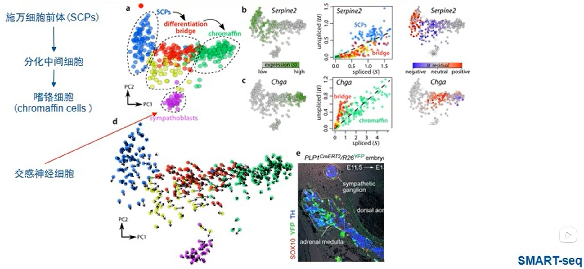

# RNA velocity 分析
## 1. RNA velocity分析的研究背景
### 1.1 什么是RNA速度
轨迹推断（Trajectory Inference, TI）
轨迹推断：成千上万单细胞的组学水中推断细胞发育轨迹的重要方法
monocle基于降维的算法
不足：
- 对分析胚胎发生或组织再生现象提出了挑战
- 不能精确定量细胞的状态，根据转录组的相似度而非细胞的真实状态

### 1.2 RNA速度解决什么生物学问题

## 2. RNA velocity分析的原理
### RNA velocity of single cells:
mRNA剪接前后的比例来估计RNA丰度随时间的变化，这种变化代表了细胞状态的改变，是一种动态的对单细胞状态的观测
velocyto
研究的纬度：mRNA速度（基因表达状态的时间导数）
展示： 细胞的真实状态
输入文件：10X的bam文件
Monocle
研究的纬度：RNA丰度的表达量
展示：转录组的相似度
输入文件：10X的表达矩阵
### mRNA生命周期
转录，剪接，成熟mRNA翻译成蛋白，降解
细胞处于平衡状态
V不等于0，任何方向的改变可能会导致细胞的行为发生变化

### 未剪接RNA和剪接RNA的动态过程

基于SMART-seq2, inDrop和10X的单细胞RNA-seq数据集，我们发现15～25%的reads包含未剪接的内含子序列
a 转录速率
U 未剪接mRNA分子丰度
s 成熟mRNA分子丰度
###识别未剪接和剪接的RNA
**Spliced:** only to the exonic regions
**Unspliced:** spanned exon-intron boundary, mapped to the intron
**Ambigous:** exonic-only and other intronic
**discard:** multiple mappings, mapped inside repeat-masked
###昼夜节律相关基因证实mRNA动态变化
未剪接和剪接mRNA之间的平衡可以预测细胞状态进展
###简化原理


应用



人胚胎中谷氨酸能神经元分化

## 3. velocity软件的安装
分为python版本和R版本
python版本
```shell
#method1
conda install numpy scipy cython numba matplotlib scikit-learn h5py click
pip install pysam
pip install velocyto
#method2
git clone https://github.com/velocyto-team/velocyto.py.git
cd velocyto.py
pip install -e

```
R版本安装
```R
#安装velocity.R
library(devtools)
install_github("velocyto-team/velocyto.R")
#需要安装hdf5，详细见hdf5的安装
BiocManager::install("pcaMethods")
#安装依赖
yum install boost-devel
#安装pagoda2
BiocManager::install(c("AnnotationDbi", "BiocGenerics", "GO.db", "pcaMethods"))
devtools::install_github("hms-dbmi/pagoda2")
#安装依赖
yum install openssl-devel libcurl-devel
```

## 4. velocyto软件的使用和结果解读

https://velocyto.org/velocyto.py/tutorial/cli.html

做alignment获得新的用于计算rna velocity 的bam文件和loom文件，标蓝，其中loom文件用于后续的相关图表分析的输入文件


**细胞表达基因的统计分析图**

```R
library(velocyto.R)
loom <- '/DATA/cellranger.loom'
ldat <- read.loom.matrices(loom)
prefix <- 'cellranger'
emat <- ldat$spliced
hist(log10(colSums(emat)), col='wheat', xlab='cell size')
```

http://pklab.med.harvard.edu/velocyto/notebooks/R/SCG71.nb.html

**数据过滤和标准化**
```R
#对数据进行过滤，对大于等于200个基因的细胞进行筛选
emat <- emat[, colSums(emat)>=200]
#导入pagoda2包，pagoda2用来生成细胞矩阵
library(pagoda2)
rownames(emat) <- make.unique(rownames(emat))
#读入数据进行标准化
r<- Pagoda2$new(emat, modelType='plain', trim=10, log.sscale=T)
#查看作图结果；对表达量差异很大的基因对下游分析所占比重进行调整
r$adjustVariance(plot=T, do.par=T, gam.k=10)
```

展示基因表达变化情况：主要用来进行变化较大的基因的挑选

**细胞聚类和细胞嵌入分析**
```R
#对细胞进行聚类和细胞嵌入分析
r$calculatePcaReduction(nPcs=100, n.odgenes=3e3, maxit=300)
r$makeKnnGraph(k=30, type='PCA', center=T, distance='cosine')
r$getKnnCluster(method=multilevel.community, type='PCA', name='multilevel')
r$getEmbedding(type='PCA', embeddingType='tSNE', perplexity=50, verbose=T)
#作图展示聚类结果
par(mfrow=c(1,2))
r$plotEmbedding(type='PCA', embeddingType='tSNE', show.legend=F, mark.clusters=T, min.group.size=10, shuffle.colors=F, mark.cluster.cex=1, alpha=0.3, main='cell clusters')
r$plotEmbedding(type='PCA', embeddingType='tSNE', colors=r$depth, main='depth')
```

左图为样品降维聚类图，右图为每个细胞的umi总数
**RNA速度可视化**
```R
#确认剪接和未剪接位点的数据
emat <- ldat$spliced
nmat <- ldat$unspliced

#通过p2对细胞进行过滤
emat <- emat[, rownames(r$counts)]
nmat <- nmat[, rownames(r$counts)]
#对分类数据进行标记
cluster.label <- r$cluster$PCA$multilevel
cell.colors <- pagoda2::fac2col(cluster.label)
# take embedding form p2
emb <- r$embeddings$PCA$tSNE
#计算细胞间的距离
cell.dist <- as.dist(1-armaCor(t(r$reduction$PCA)))
#基于最小平均表达量筛选基因（至少在一个簇中）， 输出产生的有效基因数
emat <- filter.genes.by.cluster.expression(emat, cluster.label, min.max.cluster.average = 0.2)
nmat <- filter.genes.by.cluster.expression(nmat, cluster.label,min.max.cluster.average = 0.05)
length(intersect(rownames(emat), rownames(nmat)))
#计算RNA速度
fit.quantile<- 0.02
rvel.cd<- gene.relative.velocity.estimates(emat, nmat, deltaT=1, kCells=25, cell.dist=cell.dist, fit.quantile=fit.quantile)
#可视化RNA速度结果
show.velocity.on.embedding.cor(emb, rvel.cd, n=200, scale='sqrt', cell.colors=ac(cell.colors, alpha=0.5), cex=0.8, arrow.scale=3, show.grid.flow=TRUE, min.grid.cell.mass=0.5, grid.n=40, arrow.lwd=1, do.par=F, cell.border.alpha = 0.1)
```

**可视化特定的基因**
```R
gene <- "Camp"
gene.relative.velocity.estimates(emat, nmat, deltaT=1, kCells=25, kGenes=1, fit.quantile=fit.quantile, cell.emb=emb, cell.colors=cell.colors, cell.dist=cell.dist, show.gene=gene, old.fit=rvel.cd, do.par=T)
```

## RNA velocity 总结
- 指向必须是已经测得的细胞，所以并不能揭示潜在路径
- 根据提供的坐标轴位置，提示已知细胞群里最有可能的发育方向
- 对数据进行回收利用，通过对unspliced reads获得了细胞发育轨迹的潜在可能方向
- 做一些之前做不了的动力学研究，比如人前额大脑细胞