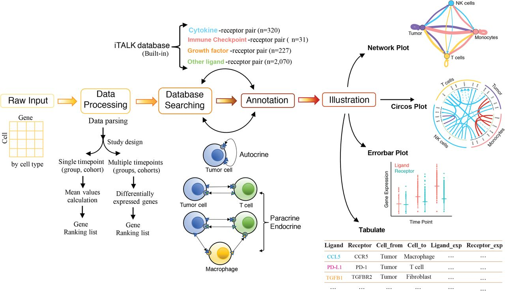

#10X单细胞转录组细胞通讯分析
##1 10X单细胞转录组细胞通讯分析introduction
###1.1 细胞通讯方式
- direct cell-cell communication, direct binding, 细胞免疫，受体和配体
- neural communication
- 纳米管和胞浆
- 囊泡通讯
- 细胞与光子
- RNA
- 微生物
- 植物
###1.2 应用领域
- 细分发育：细胞的发育过程中涉及到大量的细胞分化与增殖，具体那些细胞什么阶段增殖，发育成什么样的细胞，这些功能与细胞之间的通讯有着极其重要的关联，细胞通讯在这里发挥主导作用。
- 神经科学：神经细胞直接的信号传导是神经系统发挥作用的关键的一环，这主要是通过细胞之间的通讯来完成的。
- 肿瘤微环境：肿瘤微环境或者说是免疫环境方面是细胞通讯分析的另一个十分重要的方面，免疫细胞的识别，抗原呈递，T细胞的毒性作用，B细胞的抗体分泌，巨噬细胞的吞噬讲解作用大多在细胞的通讯的作用下完成的。
- 细胞图谱：生物体是许许多多的单细胞构成，不同的细胞有不同的功能，生物体的功能实现是有各个组织细胞亚群协调来完成的，这些协调的作用主要是通过细胞与细胞直接的通讯来完成的。
###1.3 单细胞转录组细胞通讯分析的发展
- 2015 Rami lowski等人整合了人的受体配体数据库
- 2018 Guide to PHARMACOLOGY开发的药物数据中包含了较多的细胞是受体配体数据
- 2018 Vento-Tormo等人研究了胚胎的细胞通讯，并开发了cellphoneDB数据库
- 2019 2019年1月份的时候md Wanglinhua实验室开发了ITALK工具，用于细胞通讯分析可视化
- 2019 12月份的时候，Browaeys等人开发了一种基于人的或者小鼠的数据建模，预测细胞通讯分析
- 2020 1月Anthony等在NC上发表文章中介绍了细胞通讯分析工具Celltalker
- 2020 CellphoneDB V2.0.0
###1.4 常见单细胞通讯分析的方法
- CellphoneDB V2.0.0 新版的细胞通讯分析，出了收集别的数据库的配体受体分析意外，还考虑到了受体和配体非一一配对的关系
- iTalk 通过平均表达量方式，筛选高表达的配体受体，根据结果做圈图。优势在于数据库比较方便，可以通过输入自己的数据库进行其他物种的分析
- Celltalk 主要是通过表达量筛选，匹配2015年和2018年受体配体的数据库，可视化
- NicheNet一种通过将互相作用细胞的表达数据与信号和基因调控网络的先验知识相结合来预测相互作用细胞之间的配体靶标联系的方法。
##2.掌握使用CellphoneDB进行细胞通讯分析
###2.1 CellphoneDB V2.0.0介绍
作者通过整合已有的蛋白互作的数据、分泌蛋白，膜蛋白以及蛋白复合物等数据，构建配体受体数据库，一共获得2952对互作数据对，然后根据起表达量进行筛选，匹配不同细胞或者细胞亚群之间的相互作用。整合数据库包括IUPHAR、DLRP等10种数据库，数据库链接如下： https://www.cellphonedb.org/ppi-resources. 目前支持的物种：人。
###2.2 CellphoneDB的使用-整体参数说明
安装成功后，直接输入cellphonedb，cellphonedb主要分成4个模块，我们主要进行分析的method，plot模块（分别是分析和画图模块），query是进行数据查询的模块，查询基因有那些互作结果，database是输入数据库，一般默认可以不输入，直接使用即可。
Database主要涉及数据库相关，涉及到自建数据库，下载数据库等模块。
Cellphonedb的query是进行数据查询的模块，查询基因有那些互作结果，get_interaction_gene 结果为数据库涉及到的基因，find_interactions_by_element可以找到特定基因的受体配体作用数据对。
###2.3 CellphoneDB的使用-method和plot
method analysis CellphoneDB进行细胞通讯分析有两种方法，一种是世界使用analysis，不进行置换检验进行结果显著性检验。
method statistical_analysis cellphoneDB另外的一种分析的方法进行置换检验，找到具有统计学显著意义的结果
plot dot_plot 根据statistical_analysis的结果进行绘图，首先绘制气泡图，使用桉树为dot_plot
plot heatmap_plot 根据statistical_analysis的结果进行绘图，这里展示了不同亚群之间的细胞通讯作用对的数目热图。一共两个热图，其中一个热图为直接使用所有作用对，另外一个是对数据进行log处理后做热图。
####2.3.1 method statistical_analysis
输入文件有三个 counts.txt meta.txt db (一般数据库就用官方数据库即可，默认参数)
如果是用seurat分析的输出文件rds文件，则可以如下输出cellphonedb所需的输入文件
输出meta矩阵
```R
write.table(data.frame(cell=rownames(rds@meta.data).cell_type=rds@meta.data$seurat_clusters), 'meta.txt', sep='\t', quote=F, row.names=F)
```
输出表达矩阵
```R
write.table(dplyr::bind_cols(Gene=rownames(rds@assays$RNA@data), as.data.frame(rds@assays$RNA@data)), 'counts.txt', sep='\t', quote=F, row.names=F)
```
随机排列进行统计学检验

结果有四个文件，deconvluted.txt每个基因在所有亚群中的平均表达量文件， means.txt每对受体配体的平均表达量，pvalues.txt每对受体配体的p值，如果analysis进行分析的时候，没有此文件， signficant_means.txt 每对受体配体的显著性结果的平均表达量（p.vaule < 0.05)，否则没有表达量值。对于一般的10Xgenomics单细胞转录组项目来说，需要添加参数 --counts-data=gene_name， 但是如果行名为ensemble名称的话，则可以默认值即可。
###2.3.2 plot dot_plot

```shell
less outdir/significant_means.txt | cut -f 2 | sed '1d' | head -15 > row.txt
cellphonedb plot dot_plot --means-path outdir/means.txt --pvalues-path outdir/pvalues.txt --output-path outdir/ --output-name plot.pdf --row row.txt
```
结果文件
deconvoluted.txt 每个基因在所有亚群中的平均表达量文件
means.txt 每对受体配体的平均表达量结果文件
plot.pdf 在原先的目录下生成一个气泡图pdf文件
pvalues.txt 每对受体配体的p值，如果analysis进行分析的时候，没有此文件
signficant_means.txt 每对受体配体的显著性结果的平均表达量值（p.value <0.05）， 否则没有表达量值
气泡图展示：每一列为两个细胞亚群，每一行为一对受体配体名称，颜色代表两个亚群这两个基因的平均表达量高低，越红表示表达量越高，气泡大小代表P值的-log10值，气泡越大，说明其越显著。
###2.3.3 plot heatmap_plot
```shell
cellphonedb plot heatmap_plot meta.txt --pvalues-path outdir/pvalues.txt --output-path outdir/ --count-name heatmap_count.pdf --log-name heatmap_log_count.pdf --count-network-name count_network.txt --interaction-count-name interaction_count.txt
```
结果文件
count_network.txt 每个亚群一共有的受体配体的数目文件
deconvoluted.txt  每个基因在所有亚群中的平均表达量文件
heatmap_count.pdf 细胞亚群之间有的相互作用的受体配体的数据热图
heatmap_log_count.pdf 细胞亚群之间有的相互作用的受体配体的数目log10值后的热图
interaction_count.txt 每个亚群之间有的相互作用的受体配体的数目，一般可以通过cytoscape进行展示
means.txt 每对受体配体的平均表达量结果文件
plot.pdf 在原先的目录下会生成一个气泡图pdf文件
pvaules.txt 每对受体配体的p值，如果analysis进行分析的时候，没有此文件
significant_means.txt 每对受体配体的显著性结果的平均表达量值（p.vale < 0.05), 否则没有表达量值

##3 iTalk进行细胞通讯分析
### 3.1 介绍
iTalk是由MD研究中心wanglinhua团队开发的一款细胞通讯分析工具。

Raw Input
Data Processing
Database Searching
Annotation
Illustration