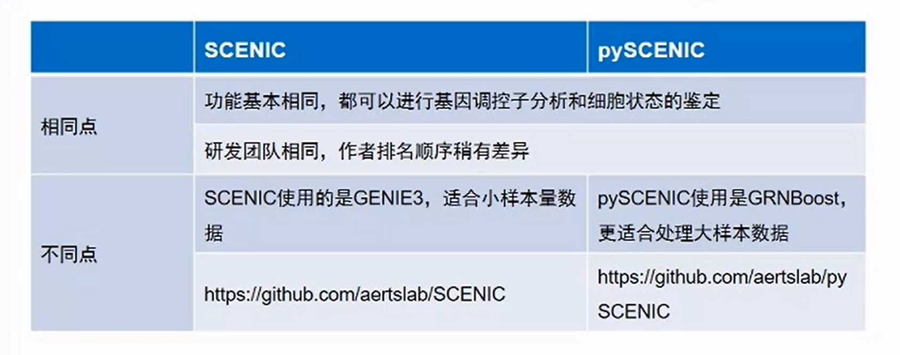

#基因调控网络分析
##基因调控网络分析
###基因调控网络简介
基因调控网络，决定并维持cell-type-specific的转录状态，反过来又构成了细胞形态和功能的基础。每种细胞类型或稳定状态均由一组特异的转录因子与其靶标基因组合构成，在这个组合中活跃的转录因子与基因组中的一组顺式调节区域相互作用并与染色质结构互相作用，从而产生特定的基因表达谱。
###单细胞转录组中的基因调控网络分析
软件SCENIC(Single Cellr Egulatory Network Inference and Clustering),利用单细胞转录组数据，进行调控子的分析，并构建基因调控网络，鉴定稳定的细胞状态
- 共表达模块分析 GENIE3
- 调控元件分析 RcisTarget
- 细胞网络活动度分析 AUCell
- 鉴定稳定的细胞状态 cluster

###应用
- 批次效应的去除
  1. 结合已发表数据联合分析
  2. 不同时间点收集的立场样本进行联合分析
  3. 多团队，多平台数据联合分析
- 细胞状态鉴定
- 复杂细胞群分析
- 潜在驱动因子挖掘
- 跨物种生物学问题研究
##pySCENIC application